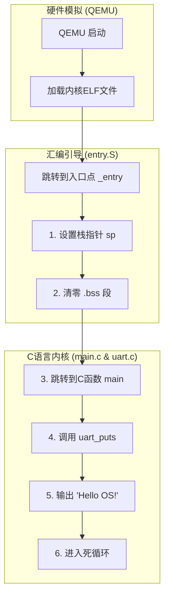

# 实验一：RISC-V引导与裸机启动

**姓名**：李璋平
**学号**：2023302051087
**日期**：2025-12-16

## 一、实验概述

### 实验目标

本次实验的核心目标是理解并实现一个最简操作系统的引导（Boot）过程。通过编写RISC-V汇编启动代码、链接器脚本以及C语言串口（UART）驱动，最终在QEMU模拟器中成功启动我们构建的内核，并通过串口输出"Hello OS!"字符串。

### 完成情况

- ✅ **启动汇编代码 (entry.S)**: 成功实现，负责设置栈指针和清零BSS段。
- ✅ **链接器脚本 (kernel.ld)**: 成功编写，定义了内核的内存布局、入口点和各个段的位置。
- ✅ **UART驱动 (uart.c)**: 成功实现，通过内存映射I/O方式向串口发送字符。
- ✅ **主函数 (main.c)**: 成功编写，调用UART驱动输出目标字符串。
- ✅ **QEMU验证**: 编译链接后的内核能在QEMU中正确运行并打印"Hello OS!"。

### 开发环境

- **操作系统**: Ubuntu 22.04.5 LTS
- **工具链 (GCC)**: riscv64-unknown-elf-gcc 12.2.0
- **模拟器 (QEMU)**: 8.2.0

---

## 二、技术设计

### 1. 系统架构与启动流程

本实验实现的操作系统内核启动流程极其精简，可分为硬件模拟、汇编引导和C语言执行三个阶段：



**流程说明**:
1.  **QEMU加载**: QEMU `virt` 平台模拟RISC-V硬件，并将我们编译好的`kernel.elf`文件加载到物理内存的 `0x80200000` 地址处。
2.  **汇编引导**:
    *   CPU从链接脚本指定的入口点 `_entry` 开始执行。
    *   首先，初始化栈指针 `sp`，为后续的C函数调用准备环境。
    *   然后，调用 `clear_bss` 函数，将BSS段（存放未初始化的全局变量和静态变量）全部清零，这是C语言标准所要求的。
3.  **C语言执行**:
    *   汇编代码通过 `call` 指令跳转到C语言的 `main` 函数。
    *   `main` 函数内部调用 `uart_puts`，通过轮询方式逐字符地将 "Hello OS!" 字符串写入UART的发送寄存器。
    *   输出完成后，程序进入一个无限循环 `spin`，防止CPU继续执行未知指令。

**与xv6对比**:
- **简化了特权级切换**: xv6的启动包含从M-mode到S-mode的切换过程，而本实验假设OpenSBI已完成该工作，内核直接从S-mode开始执行。
- **单核启动**: xv6需要处理多核（hart）的启动同步，本实验只考虑单核情况，流程更直接。
- **无复杂硬件初始化**: xv6需要初始化PLIC、CLINT等中断相关设备，本实验仅关注最基本的UART设备。

### 2. 关键“数据结构”——内存布局与硬件映射

在本次实验中，虽然没有复杂的C语言数据结构，但**内存布局**和**硬件寄存器映射**是两个至关重要的概念性“结构”。

#### 内核内存布局 (由 `kernel.ld` 定义)

内核在物理内存中的组织方式如下，起始于 `0x80200000`:

| 内存段      | 起始/结束符号       | 描述                               |
| :---------- | :------------------ | :--------------------------------- |
| **.text**   | `_entry` ~ `etext`  | 存放程序代码，包括 `entry.S` 和C函数。 |
| **.rodata** | -                   | 存放只读数据，如字符串常量。     |
| **.data**   | -                   | 存放已初始化的全局变量和静态变量。 |
| **.stack**  | `stack0` ~ `stack_top` | 内核栈空间，大小为16KB (4 pages)。 |
| **.bss**    | `_bss_start` ~ `_bss_end` | 存放未初始化的全局/静态变量，启动时需清零。 |
| **end**     | `end`               | 标记内核在内存中的结束位置。     |

这样的布局确保了代码、数据、栈各司其职，并且通过符号（如 `_bss_start`）为汇编和C代码提供了操作内存区域的依据。

#### UART设备寄存器映射

QEMU `virt` 平台将UART设备的相关寄存器映射到固定的物理地址 `0x10000000`。我们通过C语言中的宏定义来访问它们：

```c
#define UART0 0x10000000L

// 寄存器偏移
#define THR 0 // (W) Transmitter Holding Register: 发送数据
#define RHR 0 // (R) Receiver Holding Register: 接收数据
#define LSR 5 // (R) Line Status Register: 线路状态
```
内核通过直接读写这些地址（内存映射I/O）来与UART硬件交互，而无需专门的I/O指令。

### 3. 核心算法：UART轮询发送

`uart_putc` 函数是实现输出的核心，其算法基于轮询机制：

1.  **读取状态**: 从 `UART0 + LSR` 地址读取线路状态寄存器（LSR）的值。
2.  **检查标志位**: 检查LSR的第5位（`LSR_TX_IDLE`）。该位为1表示UART的发送保持寄存器（THR）为空，可以接收新的字符。
3.  **循环等待**: 如果标志位为0，说明UART正忙，CPU需要循环执行步骤1和2，原地等待。
4.  **发送数据**: 一旦标志位为1，就将待发送的字符写入 `UART0 + THR` 地址，UART硬件会自动将其发送出去。

这个简单的阻塞式算法确保了字符能被按顺序、不丢失地发送，尽管它会占用CPU时间，但在我们这个简单的内核中已足够。

---

## 三、实现细节与关键代码

### 1. 启动入口与环境初始化 (`entry.S`)

这是内核的第一行代码，负责为C语言环境搭建最基础的舞台。

```asm
.section .text
.global _entry

_entry:
    # 1. 设置栈指针
    #    将sp指向我们在链接脚本中定义的栈顶地址 `stack_top`。
    #    C函数调用依赖于栈来保存返回地址、局部变量等。
    #    这是调用任何C函数前的必要步骤。
    la sp, stack_top

    # 2. 清零 BSS 段
    #    C语言规范要求所有未初始化的全局变量和静态变量默认为0。
    #    ELF文件中不存储这些0，因此需要代码在启动时手动清空这片内存。
    call clear_bss

    # 3. 跳转到 C 主函数 main()
    #    基础环境设置完毕，将控制权交给C代码。
    call main

spin:
    # 内核主任务完成后，进入无限循环，防止CPU失控。
    j spin

# BSS 清零函数实现
clear_bss:
    la a0, _bss_start
    la a1, _bss_end
bss_clear_loop:
    # 如果起始地址(a0)等于结束地址(a1)，则清零完成。
    beq a0, a1, bss_clear_done
    # 将0写入a0指向的8字节内存。
    sd zero, 0(a0)
    # 地址向后移动8字节。
    addi a0, a0, 8
    j bss_clear_loop
bss_clear_done:
    ret
```

### 2. 定义内存布局 (`kernel.ld`)

链接器脚本是内核的“建筑蓝图”，它告诉链接器如何组织各个目标文件（`.o`）中的代码和数据，并将它们放置在内存的正确位置。

```ld
/* ... 省略头部 ... */
SECTIONS
{
    /* 内核起始物理地址 */
    . = 0x80200000;

    /* 代码段: 确保 entry.o 在最前面 */
    .text : {
        kernel/boot/entry.o(.text)
        *(.text .text.*)
        PROVIDE(etext = .); /* 定义代码段结束符号 */
    } 

    /* 只读数据段、数据段 */
    .rodata : { *(.rodata .rodata.*) } 
    .data : { *(.data .data.*) } 
    
    /* 栈段: NOLOAD表示不加载内容，只预留空间 */
    .stack (NOLOAD) : {
        . = ALIGN(16);
        PROVIDE(stack0 = .);
        . += 4096 * 4;  /* 预留16KB栈空间 */
        PROVIDE(stack_top = .);
    }

    /* BSS段: 由启动代码清零 */
    .bss : {
        PROVIDE(_bss_start = .);
        *(.sbss .sbss.*)
        *(.bss .bss.*)
        PROVIDE(_bss_end = .);
    }

    PROVIDE(end = .);
}
```
**关键点**:
- `ENTRY(_entry)`: 指定 `_entry` 为程序入口。
- `. = 0x80200000;`: 设置程序的加载地址。
- `PROVIDE(...)`: 定义了多个符号，如 `_bss_start`、`stack_top`，供汇编和C代码引用。

### 3. UART串口驱动 (`uart.c`)

这是内核与外部世界（通过串口终端）交互的唯一途径。

```c
// QEMU virt机器将UART设备映射到物理地址0x10000000。
#define UART0 0x10000000L

// UART寄存器相对于基地址的偏移量。
#define THR 0 // (W) Transmitter Holding Register
#define LSR 5 // (R) Line Status Register

// LSR寄存器中的位定义。
#define LSR_TX_IDLE (1 << 5) // Transmitter Holding Register is empty.

/**
 * @brief 向UART发送单个字符 (阻塞式)
 * @param c 要发送的字符
 */
void uart_putc(char c) {
    // 持续等待，直到发送保持寄存器为空 (LSR[5] == 1)。
    // `volatile` 关键字防止编译器优化掉对内存的重复读取。
    while ((*(volatile unsigned char *)(UART0 + LSR) & LSR_TX_IDLE) == 0)
        ;
    
    // 将字符写入发送保持寄存器。
    *(volatile unsigned char *)(UART0 + THR) = c;
}

/**
 * @brief 发送一个以'\0'结尾的字符串。
 * @param s 字符串指针
 */
void uart_puts(char *s) {
    while (*s) {
        uart_putc(*s);
        s++;
    }
}
```