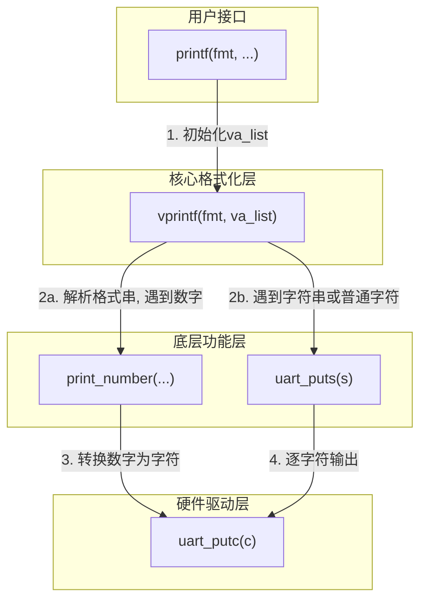

---

# 实验二：内核printf与清屏功能实现

**姓名**：李璋平
**学号**：2023302051087
**日期**：2025-12-16

## 一、实验概述

### 实验目标

本次实验的目标是基于实验一的裸机环境，在内核中实现一个功能相对完整的 `printf` 函数，用于格式化输出。同时，通过 `printf` 输出特定的 ANSI 转义序列，实现清屏、光标定位等基本的控制台控制功能。

### 完成情况

- ✅ **核心 `printf` 实现**: 成功实现了支持 `%d`, `%x`, `%s`, `%c`, `%p`, `%%` 等常用格式说明符的 `printf`。
- ✅ **边界情况处理**: 能够正确处理 `INT_MIN`、空指针 `NULL` 字符串等边界情况。
- ✅ **ANSI 控制台功能**:
    - ✅ `clear_screen()`: 实现清空整个屏幕。
    - ✅ `goto_xy()`: 实现将光标移动到屏幕指定坐标。
    - ✅ `clear_line()`: 实现清除光标所在行。
- ✅ **综合测试**: 编写了 `test_lab2()` 函数，对所有实现的功能进行了验证。

### 开发环境

- **操作系统**: Ubuntu 22.04.5 LTS
- **工具链 (GCC)**: riscv64-unknown-elf-gcc 12.2.0
- **模拟器 (QEMU)**: 8.2.0

---

## 二、技术设计

### 1. 系统架构与函数调用流程

`printf` 的实现采用了模块化的分层设计，将复杂的格式化任务分解为几个独立的函数，调用关系清晰：



**流程说明**:
1.  **`printf()`**: 作为顶层入口，它接收可变数量的参数，使用 `va_start` 初始化 `va_list`，然后将格式化任务全权委托给 `vprintf`。
2.  **`vprintf()`**: 这是格式化处理的核心。它像一个状态机，逐字符地解析格式字符串 `fmt`。
    *   遇到普通字符，直接调用 `uart_putc` 输出。
    *   遇到 `%`，则进入“格式解析”状态，根据后面的字符（如 `d`, `x`, `s`）决定如何处理，并使用 `va_arg` 从 `va_list` 中提取相应类型的参数。
3.  **`print_number()`**: 专门负责将各种进制的整数（十进制、十六进制）转换为字符串并输出。
4.  **`uart_puts()` / `uart_putc()`**: 底层的字符和字符串输出函数，直接与硬件驱动交互。

### 2. 核心算法

#### 算法一：格式字符串解析 (`vprintf`)

`vprintf` 函数通过一个 `while` 循环遍历格式字符串，其核心是一个 `switch` 语句，用于处理 `%` 后的格式说明符。这种设计模式清晰地将不同格式的处理逻辑隔离开来。

#### 算法二：整数到字符串的转换 (`print_number`)

为了高效且正确地转换数字，采用了经典的“**先反转存储，再正序输出**”算法：

1.  **处理符号**: 首先判断数字是否为负。如果是，则记录下来，并将数字转为正数处理。这里巧妙地使用了 `long long` 类型来接收参数，避免了对 `INT_MIN` 取负时发生整数溢出的问题。
2.  **反序生成**: 使用 `do-while` 循环，通过反复对数字进行“模 `base`”和“除 `base`”操作，从低位到高位（个位、十位...）依次提取出每一位的数字字符，并存入一个临时缓冲区 `buf`。此时 `buf` 中存储的是反序的数字串。
3.  **正序输出**: 从 `buf` 的末尾向前遍历，逐个字符地调用 `uart_putc` 输出。这样，最终显示在屏幕上的数字顺序就是正确的。

#### 算法三：通过 ANSI 转义序列控制台

控制台（终端）支持一系列以 `\033[` (ESC [) 开头的特殊字符串，称为 ANSI 转义序列。通过向串口打印这些序列，就可以命令终端执行特定操作，而无需复杂的驱动。

| 功能         | ANSI 序列        | 描述                             |
| :----------- | :--------------- | :------------------------------- |
| **清屏**     | `\033[2J`        | 清除整个屏幕。                   |
| **光标归位** | `\033[H`         | 将光标移动到左上角 (1,1) 位置。    |
| **光标定位** | `\033[<y>;<x>H` | 将光标移动到第 `y` 行，第 `x` 列。 |
| **清除行**   | `\033[2K`        | 清除光标所在的整行。             |

我们的 `clear_screen` 等函数正是通过 `printf` 巧妙地将这些序列发送到串口来实现的。

---

## 三、实现细节与关键代码

### 1. 关键函数：`print_number()`

这是 `printf` 的关键部分，负责处理所有数字的打印。

```c
// 临时缓冲区，用于存放转换后的数字字符
char buf[20];
int i = 0;
unsigned long long n; // 使用无符号类型简化逻辑

// ... 处理符号 ...
if (is_signed && num < 0) {
    sign = 1;
    n = -num; // 将负数转为正数统一处理
} else {
    n = num;
}

// 核心转换循环: 生成反序的数字字符串
do {
    buf[i++] = digits[n % base]; // 取模获取最低位
    n /= base;                   // 除法去掉最低位
} while (n > 0);

if (sign) {
    buf[i++] = '-';
}

// 按正确顺序打印: 从后往前遍历缓冲区
while (--i >= 0) {
    uart_putc(buf[i]);
}
```
**实现亮点**:
- **`long long` 参数**: 解决了 `int` 类型中 `INT_MIN` 的边界问题。`-(-2147483648)` 在32位有符号整数中会溢出，但在 `long long` 中不会。
- **`do-while` 循环**: 确保了即使输入数字为 `0`，也能正确处理并输出一个字符 '0'。

### 2. 关键函数：`vprintf()` 的 `switch` 逻辑

负责解析格式符并分发任务。

```c
// ... 在 `while` 循环中 ...
p++; // 跳过 '%'

// ... is_long 标志位处理 ...

switch (*p) {
    case 'd': { // 十进制整数
        // 根据 is_long 标志决定从 va_list 中提取 int 还是 long long
        long long val = is_long ? va_arg(ap, long long) : va_arg(ap, int);
        print_number(val, 10, 1);
        break;
    }
    case 's': { // 字符串
        char *s = va_arg(ap, char *);
        if (s == NULL) { // 优雅地处理空指针
            uart_puts("(null)");
        } else {
            uart_puts(s);
        }
        break;
    }
    // ... 其他 case ...
}
```
**实现亮点**:
- **健壮性**: 对 `%s` 格式符传入 `NULL` 指针的情况做了特殊处理，打印 `(null)` 而不是导致内核崩溃，这是高质量代码的体现。
- **可扩展性**: 代码中已经预留了对 `l` 修饰符（如 `%ld`）的支持，虽然本次实验未强制要求，但展示了良好的设计。

### 3. 控制台功能实现

实现简洁，本质上是调用 `printf` 发送特殊字符串。

```c
void clear_screen(void)
{
    // \033[2J: 清除整个屏幕
    // \033[H:  将光标移动到左上角 (第一行,第一列)
    printf("\033[2J\033[H");
}
```
**实现亮点**:
- **高层抽象**: 将底层晦涩的 ANSI 序列封装成意义明确的函数（如 `clear_screen`），极大提高了代码的可读性和易用性。体现了软件工程中的“封装”思想。