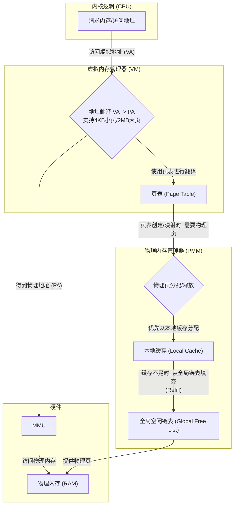

---

# 实验三：页表与内存管理

**姓名**：李璋平
**学号**：2023302051087
**日期**：2025-12-16

## 一、实验概述

### 实验目标

本次实验的核心目标是构建操作系统内核的内存管理两大基石：物理内存管理器（PMM）和虚拟内存管理器（VM），并在其中引入性能优化策略。具体任务包括：
1.  实现一个带有**缓存池**的物理页分配器，以减少对全局锁的竞争并提高分配效率。
2.  基于 RISC-V Sv39 规范，实现三级页表机制，并增加对 **2MB大页** 的支持，以优化大块内存区域的映射效率和 TLB 性能。
3.  为内核创建一套完整的页表，并最终启用分页机制，使内核运行在虚拟地址空间之上。

### 完成情况

- ✅ **物理内存管理器 (PMM)**: 成功实现了基于**空闲链表 + 本地缓存**的物理页分配与释放 (`alloc_page`, `free_page`)。
- ✅ **页表机制 (VM)**: 成功实现了 Sv39 三级页表的遍历 (`walk`) 和映射 (`map_page`) 功能，并实现了**大页映射 (`map_megapage`)**。
- ✅ **内核地址空间创建 (`kvminit`)**: 成功为内核创建了恒等映射的页表，并利用 `map_region` 智能地为大块连续内存选择大页映射。
- ✅ **启用分页 (`kvminithart`)**: 成功加载页表基地址到 `satp` 寄存器并刷新 TLB，使内核平稳地从物理地址过渡到虚拟地址运行。
- ✅ **单元测试**: 编写并成功通过了针对 PMM 和 VM 的单元测试。

### 开发环境

- **操作系统**: Ubuntu 22.04.5 LTS
- **工具链 (GCC)**: riscv64-unknown-elf-gcc 12.2.0
- **模拟器 (QEMU)**: 8.2.0

---

## 二、技术设计

### 1. 系统架构

本次实验的内存管理系统分为层次分明的两个部分：PMM 和 VM，它们协同工作，并在设计中融入了性能优化的考量。



**交互流程与优化点**:
1.  **PMM 缓存**: `alloc_page` 优先从一个小的本地数组缓存 (`page_cache`) 中获取页面。只有当缓存为空时，才会从全局 `freelist` 中批量填充 (`refill_cache`)。同样，`free_page` 会优先将页面放入缓存，只有当缓存满时才批量刷新 (`flush_cache`) 到全局链表。这在多核环境下能显著减少对全局链表的锁竞争。
2.  **VM 大页支持**: `map_region` 函数在映射大块连续内存时，会检查当前虚拟地址和物理地址是否都满足 2MB 对齐，且剩余映射尺寸足够大。如果满足条件，它会调用 `map_megapage` 直接在 L2 页表中创建一个叶子节点，一次性映射 2MB 内存，从而减少 TLB 的压力并提高地址翻译速度。

### 2. 物理内存管理器 (PMM) 设计

-   **核心数据结构**: 采用**两级缓存架构**。
    -   **L1 缓存**: 一个大小为 `CACHE_SIZE` (例如 8) 的静态指针数组 `page_cache`，作为快速分配/释放的本地池。
    -   **L2 存储**: 全局的**侵入式空闲链表** `freelist`，作为所有物理页的最终来源和归宿。
-   **核心算法**:
    -   `alloc_page()`:
        1.  检查 `page_cache` 是否为空。
        2.  如果为空，调用 `refill_cache()` 从 `freelist` 中批量取出最多 `CACHE_SIZE` 个页面填充缓存。
        3.  如果填充后缓存仍为空，说明物理内存耗尽，返回 `NULL`。
        4.  从 `page_cache` 顶部弹出一个页面并返回。
    -   `free_page()`:
        1.  检查 `page_cache` 是否已满。
        2.  如果已满，调用 `flush_cache()` 将缓存中的所有页面批量归还给全局 `freelist`。
        3.  将被释放的页面压入 `page_cache` 顶部。

### 3. 虚拟内存管理器 (VM) 设计

-   **核心规范**: 遵循 RISC-V **Sv39** 分页模式。
-   **大页支持**: Sv39 允许在 L2、L1 页表项中直接设置映射（形成所谓的“大页”），而无需走到 L0。本实验实现了在 L2 级别进行 2MB 大页映射。一个 L2 PTE 可以映射 512 (L1 个数) * 512 (L0 个数) * 4KB = 1GB 的空间，但如果将其作为叶子节点，则直接映射 2MB 空间。
-   **核心算法**:
    -   **`map_region(...)`**: 这是一个智能映射函数。
        1.  在一个 `while` 循环中遍历待映射的地址区间。
        2.  在每次循环开始时，检查当前地址 `va`, `pa` 和剩余长度 `size` 是否满足使用 2MB 大页的条件。
        3.  如果满足，则调用 `map_megapage()` 一次性映射 2MB，并将地址指针前进 2MB。
        4.  如果不满足，则回退到调用 `map_page()` 映射一个 4KB 小页，并将地址指针前进 4KB。
    -   **`kvminit()` 内核内存映射**: 利用 `map_region` 对内核代码段和数据段进行映射。由于内核数据段通常很大（从 `etext` 到 `PHYSTOP`），`map_region` 将能够自动地为其大量使用 2MB 大页，从而优化性能。

---

## 三、实现细节与关键代码

### 1. 关键函数：`refill_cache()` (PMM)

这是 PMM 缓存机制的核心，负责从全局池向本地缓存“补货”。

```c
static void refill_cache() {
    printf("   [PMM Cache: Refilling...]\n");
    // 循环填充本地缓存，直到满或全局链表为空
    while (cache_count < CACHE_SIZE) {
        struct run *r = freelist;
        if (r) {
            freelist = r->next; // 从全局链表取出一个节点
            page_cache[cache_count++] = (void*)r; // 放入本地缓存
        } else {
            break; // 全局内存池也空了
        }
    }
}
```
**实现要点**: 这是一个批量操作，避免了 `alloc_page` 每次都去访问可能需要加锁的全局 `freelist`，提升了效率。`flush_cache` 逻辑与此相反，同样是批量操作。

### 2. 关键函数：`map_megapage()` (VM)

实现大页映射的关键在于，它只遍历到 L2 层级就停止，并直接将 L2 的 PTE 设置为叶子节点。

```c
static int map_megapage(pagetable_t pagetable, uint64_t va, uint64_t pa, int perm) {
    // 大页映射发生在L2页表，只需要走一级, 直接定位到L2的PTE
    pte_t *pte = &pagetable[VPN_INDEX(va, 2)];

    if (*pte & PTE_V) { // L2 PTE不应该提前存在，否则可能覆盖子页表
        return -1;
    }

    // 设置为叶子PTE：物理地址 + 权限 + 有效位
    *pte = PA2PTE(pa) | perm | PTE_V;
    return 0;
}
```
**实现要点**: 与 `map_page` 中调用 `walk` 不同，`map_megapage` 直接计算出 L2 PTE 的地址并进行设置。这是因为它假设 L2 往下的子页表不存在，如果存在则会报错。

### 3. 关键函数：`map_region()` (VM)

这个函数智能地在大小页之间进行选择，是性能优化的直接体现。

```c
static void map_region(pagetable_t pt, uint64_t va_start, uint64_t va_end, uint64_t pa_start, int perm) {
    uint64_t va = va_start;
    uint64_t pa = pa_start;

    while (va < va_end) {
        // 核心判断逻辑: 地址是否对齐？剩余空间是否足够？
        if (IS_MEGAPAGE_ALIGNED(va) && IS_MEGAPAGE_ALIGNED(pa) && (va_end - va) >= MEGAPAGE_SIZE) {
            // 使用大页进行映射
            map_megapage(pt, va, pa, perm);
            va += MEGAPAGE_SIZE;
            pa += MEGAPAGE_SIZE;
        } else {
            // 否则，回退到使用4KB小页
            map_page(pt, va, pa, perm);
            va += PGSIZE;
            pa += PGSIZE;
        }
    }
}
```
**实现要点**: `IS_MEGAPAGE_ALIGNED` 宏和对剩余尺寸的判断是这里的核心逻辑，它确保了只有在最有利的情况下才使用大页，否则安全地回退到小页。

### 4. 遇到的主要难点与解决方案

**问题**: 在实现大页映射后，启用分页时发生崩溃，或者某些内存区域访问正常，另一些则失败。

**排查过程**:
1.  **对齐问题**: 最初 `map_region` 的逻辑没有严格检查 `pa` 的对齐情况，只检查了 `va`。RISC-V 规范要求大页映射的物理地址也必须是对齐的。
2.  **权限位冲突**: 大页的 PTE 也是一个普通的 `pte_t`，但如果它被设置为叶子节点，那么 `PTE_R/W/X` 位的含义就直接作用于这 2MB 区域。如果一个 L2 PTE 既被当作指向下一级页表的指针（此时 `R/W/X` 位为0），又错误地被当作叶子节点，就会导致硬件混乱。
3.  **地址计算错误**: 在 `kvminit` 中，内核代码段的起始地址 `end` 通常不是 2MB 对齐的，因此 `map_region` 在开始时必须正确地使用小页进行映射，直到遇到第一个满足大页对齐的地址。

**解决方案**:
-   在 `map_region` 中添加对 `pa` 的对齐检查 `IS_MEGAPAGE_ALIGNED(pa)`。
-   在 `map_megapage` 中增加检查 `if (*pte & PTE_V)`，确保不会覆盖一个已经存在的、可能指向下一级页表的有效PTE。
-   `map_region` 的 `while` 循环自然地处理了起始地址不对齐的情况：它会一直使用 `map_page` 进行小页映射，直到 `va` 和 `pa` 滚动到下一个 2MB 对齐的边界，然后才开始尝试使用大页。这个逻辑是正确的，无需修改，但理解其工作原理至关重要。