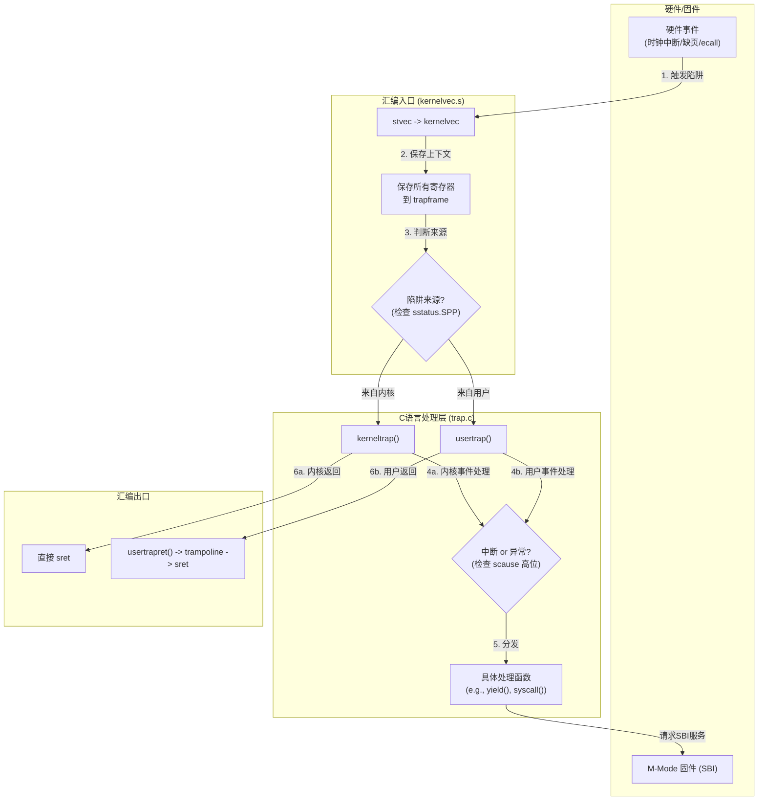

---

# 实验四：中断处理与时钟管理

**姓名**：李璋平
**学号**：2023302051087
**日期**：2025-12-16

## 一、实验概述

### 实验目标

本次实验的核心目标是为我们的操作系统构建一个完整的中断处理框架，并在此基础上实现由硬件时钟驱动的抢占式多任务调度。具体任务包括：
1.  实现一个统一的S-mode陷阱入口，能够处理来自内核态和用户态的中断与异常。
2.  编写C语言中断处理程序，能够分发不同类型的中断和异常。
3.  通过SBI调用，编程RISC-V的硬件时钟，以产生周期性的时钟中断。


### 完成情况

- ✅ **统一陷阱入口 (`kernelvec.s`)**: 成功实现了汇编代码，能够区分陷阱来源（内核/用户），保存完整的处理器上下文（`trapframe`），并跳转到C语言处理函数。
- ✅ **中断/异常分发 (`trap.c`)**: 成功实现了 `kerneltrap()` 和 `usertrap()`，能够根据 `scause` 寄存器的值对中断和异常进行分发处理。
- ✅ **时钟中断配置**: 成功通过SBI调用 `sbi_set_timer`，正确设置了周期性的硬件时钟中断。
- ✅ **中断处理框架**: 成功实现了中断处理函数的注册机制，提高了系统的模块化和可扩展性。

### 开发环境

- **操作系统**: Ubuntu 22.04.5 LTS
- **工具链 (GCC)**: riscv64-unknown-elf-gcc 12.2.0
- **模拟器 (QEMU)**: 8.2.0

---

## 二、技术设计

### 1. 系统架构与中断处理流程

中断处理是操作系统响应硬件事件的核心机制。本次实验设计的处理流程是一个严谨的多阶段过程，确保了在不同特权级下都能安全、正确地处理事件。



**流程说明**:
1.  **硬件触发**: 硬件事件发生，CPU自动跳转到 `stvec` 指向的 `kernelvec`。
2.  **汇编入口**: `kernelvec.s` 保存完整的处理器上下文到 `trapframe`，并根据陷阱来源分流。
3.  **C语言分发**: 调用 `kerneltrap` (来自内核) 或 `usertrap` (来自用户)，C代码读取 `scause` 寄存器进行事件分发。
4.  **具体处理**: 执行相应的处理逻辑，如时钟中断调用 `yield()`。
5.  **返回**: 内核陷阱直接 `sret` 返回；用户陷阱通过 `usertrapret` 机制安全返回用户态。

### 2. 关键概念与数据结构

#### 概念一：中断和异常
-   **中断**: 异步事件，由外部设备触发。`scause` 最高位为 `1`。
-   **异常**: 同步事件，由CPU执行指令时产生。`scause` 最高位为 `0`。

#### 概念二：特权级转换与上下文保存
-   **`sstatus.SPP`**: 记录陷阱发生前的特权级，是 `kernelvec.s` 分流的关键。
-   **`trapframe`**:完整保存被中断代码的所有寄存器状态，确保可以精确恢复现场。

#### 概念三：SBI 
-   M-mode 固件为 S-mode 内核提供的标准服务接口。内核通过 `ecall` 指令请求 SBI 来完成设置物理时钟等特权操作。

#### **关键数据结构：`trapframe`**

在实验四中，`trapframe`是实现中断处理机制的**核心数据结构**。它的职责是作为一个“上下文快照”，在内核处理中断或异常期间，完整地保存被中断代码的处理器状态。

```c
// trapframe 结构体，用于在中断/异常时保存所有通用寄存器
// 这个结构体在 kernelvec.s 中被填充，并作为参数传递给 C 语言的 trap 处理函数
struct trapframe {
    // a0-a7, s0-s11, t0-t6, ra, sp, gp, tp
    // 按顺序保存所有32个通用寄存器，除了 x0(zero)
    uint64_t ra;
    uint64_t sp;
    uint64_t gp;
    uint64_t tp;
    uint64_t t0, t1, t2;
    uint64_t s0, s1;
    uint64_t a0, a1, a2, a3, a4, a5, a6, a7;
    uint64_t s2, s3, s4, s5, s6, s7, s8, s9, s10, s11;
    uint64_t t3, t4, t5, t6;
    uint64_t epc;
};
```

**在中断处理中的关键作用**:

1.  **上下文的完整保存**:
    *   当中断发生时，硬件会跳转到 `kernelvec.s`。汇编代码的首要任务就是将**所有**通用寄存器的当前值，按照 `trapframe` 结构体定义的顺序，依次存储到当前进程的内核栈上。
    *   这种设计的目的是为了确保无论中断发生在C代码的哪一行，甚至是函数调用的序言或尾声部分，所有的临时状态都能被精确记录。C编译器可以自由使用任何`t`系列或`a`系列寄存器，因此必须全部保存。

2.  **现场恢复的保障**:
    *   当中断处理函数 `kerneltrap` 执行完毕并返回后，`kernelvec.s` 中的汇编代码会执行与保存相反的操作：按照 `trapframe` 的顺序，将内存中的值逐一加载回对应的CPU寄存器中。
    *   最后，执行 `sret` 指令。`sret` 不仅会跳转回 `epc` 指向的地址，还会恢复中断前的特权级和中断使能状态。由于所有通用寄存器也已被恢复，程序可以像什么都没发生过一样继续执行。

3.  **调试信息的来源**:
    *   `epc` 字段至关重要。如果内核发生异常（例如，访问了一个无效的内存地址），`kerneltrap` 可以读取 `epc` 的值，从而准确地告诉开发者是内核中的哪一条指令导致了崩溃。

**与后期实验六版本的对比**:

-   **更纯粹**: 实验四的 `trapframe` 更专注于“保存/恢复”这一核心功能。它不包含 `kernel_satp`、`kernel_sp` 等用于特权级切换的字段，因为在实验四的阶段，主要处理的是内核态内部的中断，不涉及复杂的用户/内核切换。

---

## 三、实现细节与关键代码

### 1. 关键函数：`trap_init_s()` - S-mode 陷阱初始化

此函数在内核启动早期被调用，负责配置处理S-mode陷阱所需的所有CSR寄存器，为中断处理系统“铺好轨道”。

```c
void trap_init_s() {
    printf("Initializing S-mode trap handler...\n");

    // 1. 设置中断向量表地址到stvec寄存器
    //    所有S-mode下的中断和异常都会跳转到 kernelvec
    w_stvec((uint64_t)kernelvec);

    // 2. 开启S-mode时钟中断 (SIE.STIE = 1)
    //    SIE: Supervisor Interrupt Enable 寄存器
    w_sie(r_sie() | SIE_STIE);

    // 3. 开启S-mode全局中断 (SSTATUS.SIE = 1)
    //    这是S-mode下中断的总开关，只有它被置位，sie 中的设置才会生效。
    w_sstatus(r_sstatus() | SSTATUS_SIE);

    // 4. 注册默认的时钟中断处理函数
    register_interrupt_handler(INTERRUPT_S_TIMER, default_timer_handler);
}
```
**实现要点**:
-   该函数通过写 `stvec`, `sie`, `sstatus` 这三个关键的控制状态寄存器（CSRs），完成了中断系统的基础配置。

### 2. 关键函数：`kernelvec` - 汇编陷阱入口

这是所有中断/异常处理的硬件入口点，其核心任务是安全地保存上下文并根据来源分流。

```assembly
kernelvec:
    # 步骤 1: 检查陷阱来源
    csrr t0, sstatus
    li t1, 1 << 8       # SSTATUS_SPP 位的掩码
    and t0, t0, t1      # 提取 SPP 位
    bnez t0, kernel_to_kernel_trap # 如果 SPP=1, 跳转到内核陷阱处理

# ---- 用户态到内核态路径 ----
user_to_kernel_trap:
    # 步骤 2: 切换到内核栈
    # csrrw 原子地交换 sp 和 sscratch 的值
    csrrw sp, sscratch, sp

    # 步骤 3: 保存所有32个通用寄存器到 trapframe (sp 指向)
    # ... (省略寄存器保存代码) ...

    # 步骤 4: 调用C处理函数
    call usertrap

# ---- 内核态到内核态路径 ----
kernel_to_kernel_trap:
    # ... (在当前栈上保存寄存器) ...
    call kerneltrap
    # ... (恢复寄存器) ...
    sret
```
**实现要点**:
-   **分流**: 通过检查 `sstatus.SPP` 位，实现了对内核态陷阱和用户态陷阱的区分处理，这是保证系统安全和稳定的第一步。
-   **上下文保存**: 无论陷阱来自何处，都必须完整保存所有通用寄存器，为后续的C函数调用和最终的现场恢复提供保障。


### **3.中断处理框架**

为了提高系统的模块化和可维护性，我们设计了一个可注册的中断处理函数框架，而不是将所有处理逻辑硬编码在 `kerneltrap` 中。

#### **`trap.c` - 中断处理函数表与注册机制**

我们定义了一个函数指针数组，用于存储不同中断类型（IRQ）的处理函数。系统初始化时会注册一个默认的时钟中断处理函数。

```c
// trap.c

// 中断处理函数表
// 数组索引对应 RISC-V Supervisor-level IRQ 编号
static interrupt_handler_t interrupt_handlers[16] = {0};

// 默认时钟中断处理函数
static void default_timer_handler() {
    ticks++;
    stats.timer_count++;
    
    // 设置下一次时钟中断
    set_next_timer_interrupt();
    
    if (ticks % 100 == 0) { // 每100次中断打印一次，避免刷屏
        printf("Timer interrupt! ticks = %lu\n", ticks);
    }
}

// 注册中断处理函数
void register_interrupt_handler(int irq, interrupt_handler_t handler) {
    if (irq >= 0 && irq < 16) {
        interrupt_handlers[irq] = handler;
        printf("Registered interrupt handler for IRQ %d\n", irq);
    } else {
        printf("Invalid IRQ number: %d\n", irq);
    }
}
```
**实现要点**:
-   **函数指针数组**: `interrupt_handlers` 数组使得系统的其他模块（如设备驱动）可以为特定的硬件中断（如串口、磁盘）注册自己的处理函数，实现了中断处理逻辑的解耦。
-   **默认行为**: 通过注册 `default_timer_handler`，系统在没有更具体的调度逻辑前，也能正确地响应和重置时钟中断。

#### **`kerneltrap()` - 通用中断分发**

`kerneltrap` 的职责从具体的处理者转变为一个通用的**分发器**。它解析中断类型，并在 `interrupt_handlers` 表中查找并调用相应的处理函数。

```c
// trap.c - in kerneltrap()

void kerneltrap() {
    uint64_t scause = r_scause();
    
    if (scause & (1UL << 63)) { // 判断是中断
        // --- 这是内核态中断 ---
        // 从 scause 中提取中断号 (IRQ)
        uint64_t irq = scause & 0x7FFFFFFFFFFFFFFF;
        stats.total_interrupts++;

        // 检查是否有为该 IRQ 注册的处理函数
        if (irq < 16 && interrupt_handlers[irq]) {
            // 如果有，调用它
            interrupt_handlers[irq]();
        } else {
            // 否则，打印错误信息并停机
            printf("kerneltrap: unhandled kernel interrupt IRQ %lu\n", irq);
            while(1);
        }

        // 注意：将 yield() 调用从这里移到了具体的中断处理函数中，
        // 因为并非所有中断都需要触发调度。
        
    } else {
        // ... (异常处理) ...
    }
}
```
**实现要点**:
-   **职责分离**: `kerneltrap` 不再关心时钟中断的具体逻辑（如 `yield()` 或 `set_next_timer_interrupt()`）。它的唯一职责是：解析 IRQ -> 查表 -> 调用。
-   **灵活性**: 这种设计使得添加对新中断源（如外部中断 `INTERRUPT_S_EXTERNAL`）的支持变得非常简单，只需实现一个新的处理函数并用 `register_interrupt_handler` 注册即可，完全无需修改 `kerneltrap`。

### 4. 关键函数：`set_next_timer_interrupt()` - 设置时钟

这个函数通过SBI与M-mode固件交互，以编程物理时钟。

```c
void set_next_timer_interrupt() {
    // 通过SBI调用设置mtimecmp
    sbi_set_timer(r_time() + TIMER_INTERVAL);
}

// 在 sbi.c 中:
uint64_t sbi_call(uint64_t func_id, uint64_t arg0, ...) {
    // ... (将 func_id 和参数放入 a7, a0-a2 寄存器) ...
    asm volatile("ecall"); // 陷入 M-mode，请求 SBI 服务
    // ...
}
```
**实现要点**:
-   **特权级协作**: 内核在S-mode下无法直接访问 `mtimecmp` 寄存器，必须通过 `ecall` 指令陷入M-mode，请求SBI服务来完成硬件操作。
-   **接口抽象**: `sbi_set_timer` 将底层的 `ecall` 封装成一个清晰的C函数调用，提高了代码的可读性。

好的，遵照您的要求，这里仅提供对实验四报告中“关键代码”部分的补充内容，聚焦于**异常处理**。


### 5.关键代码：异常处理框架

除了处理中断，一个完整的陷阱系统还必须能够处理异常。我们通过一个可注册的异常处理函数表来实现模块化的异常处理。

#### **`trap.c` - 默认异常处理器与注册机制**

当发生一个未被特定模块（如缺页处理模块）注册的异常时，系统会调用一个默认的处理器，打印详细的诊断信息并停机。

```c
// trap.c

// 异常处理函数表  
static exception_handler_t exception_handlers[16] = {0};

// 默认异常处理函数
static void default_exception_handler(uint64_t cause, uint64_t epc, uint64_t tval) {
    printf("=== UNHANDLED EXCEPTION ===\n");
    printf("Exception code: %lu\n", cause);
    printf("Exception PC (sepc): 0x%lx\n", epc);
    printf("Exception value (stval): 0x%lx\n", tval);
    
    // 根据异常类型提供更详细的信息
    switch(cause) {
        case 2: printf("Illegal instruction\n"); break;
        case 5: printf("Load access fault\n"); break;
        case 7: printf("Store/AMO access fault\n"); break;
        case 8: printf("Environment call from U-mode\n"); break;
        case 12: printf("Instruction page fault\n"); break;
        case 13: printf("Load page fault\n"); break;
        case 15: printf("Store/AMO page fault\n"); break;
        default: printf("Unknown exception\n"); break;
    }
    
    printf("System halted.\n");
    while (1); // 停机
}

// 注册异常处理函数
void register_exception_handler(int exception_code, exception_handler_t handler) {
    if (exception_code >= 0 && exception_code < 16) {
        exception_handlers[exception_code] = handler;
        printf("Registered exception handler for code %d\n", exception_code);
    } else {
        printf("Invalid exception code: %d\n", exception_code);
    }
}
```
**实现要点**:
-   **函数指针数组**: `exception_handlers` 数组允许系统的其他部分（如未来的缺页处理模块）为特定类型的异常（由 `cause` 码标识）注册专门的处理函数。
-   **默认行为**: 如果没有注册特定的处理函数，`default_exception_handler` 会被调用，提供详细的调试信息，这对于内核开发至关重要。

#### **`usertrap()` - 用户态异常分发**

在 `usertrap` 函数中，我们对来自用户态的异常进行分发。目前主要处理的是系统调用（`ecall`），其他异常则交由通用异常处理框架。

```c
// trap.c - in usertrap()

void usertrap(void) {
    // ... (保存 sepc 等) ...

    uint64_t scause = r_scause();

    if (scause == 8) { // cause 8: Environment call from U-mode (系统调用)
        // sepc 指向 ecall 指令，需要+4 跳过它
        p->trapframe->epc += 4;
        // 处理系统调用
        syscall();
    } 
    else if (scause & (1UL << 63)) {
        // ... (中断处理) ...
    }
    else {
        // --- 这是用户态异常 ---
        uint64_t exception_code = scause;
        stats.exception_count++; // 统计异常次数

        if (exception_handlers[exception_code]) {
            // 如果有注册的处理函数，则调用它
            exception_handlers[exception_code](scause, r_sepc(), r_stval());
        } else {
            // 否则，调用默认处理函数
            default_exception_handler(scause, r_sepc(), r_stval());
        }
        
        // 通常，未处理的异常会导致进程被杀死
        printf("usertrap: killing process for unhandled exception\n");
        p->killed = 1;
    }

    // ... (检查 killed 标志并返回) ...
}
```
**实现要点**:
-   **系统调用特例**: `ecall` from U-mode (cause code 8) 是最常见且需要精确处理的异常。我们在此处将其分离出来，并递增 `epc` 以确保返回时不会再次执行 `ecall` 指令。
-   **通用分发**: 对于所有其他异常，代码会查询 `exception_handlers` 表。这种设计使得添加新的异常处理（如缺页中断）变得非常简单，只需实现一个处理函数并注册它即可，无需修改 `usertrap` 的核心逻辑。

注：本部分实验代码是完成后续实验后重新整理而来（当时没有单独保存这部分代码直接进行后续实验了），可能掺杂了部分其它实验的内容，也可能有部分缺失（目前检查没有发现），最终版本lab6是确保完整的