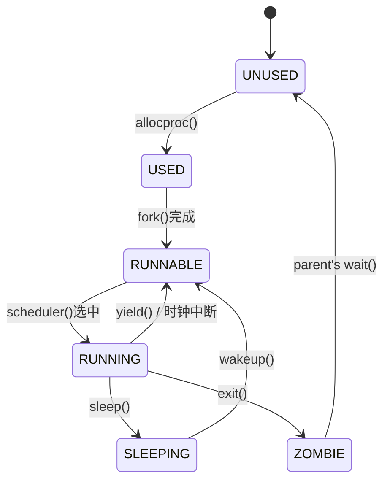

---

# 实验五：进程管理与调度

**姓名**：李璋平
**学号**：2023302051087
**日期**：2025-12-16

## 一、实验概述
注：本部分已经实现了优先级调度，但是具体介绍在扩展实验1里。
### 实验目标

本次实验的核心目标是为操作系统构建一个完整的进程管理和调度子系统。主要任务包括：
1.  定义进程控制块（PCB）和进程生命周期模型。
2.  实现进程的创建 (`fork`)、退出 (`exit`) 和等待 (`wait`) 等核心功能。
3.  实现上下文切换机制 (`swtch`)，能够在不同进程的内核上下文之间进行切换。
4.  构建一个基础的调度器 (`scheduler`)，负责从可运行的进程中选择一个投入运行。
5.  实现基本的进程同步原语 `sleep` 和 `wakeup`。

### 完成情况

- ✅ **进程控制块 (PCB)**: 成功定义了 `struct proc`，包含了进程状态、PID、内存资源、上下文等关键信息。
- ✅ **进程生命周期管理**: 成功实现了 `allocproc`, `freeproc`, `fork`, `exit`, `wait` 等函数，完整支持了进程从创建到销毁的生命周期。
- ✅ **上下文切换**: 成功实现了汇编函数 `swtch`，能够精确保存和恢复被调用者保存的寄存器。
- ✅ **调度器**: 成功实现了 `scheduler` 函数，能够调度可运行的进程，并实现了 `yield` 以支持协作式调度。
- ✅ **同步原语**: 成功实现了 `sleep` 和 `wakeup`，为后续的并发控制打下了基础。
- ✅ **自旋锁**: 实现了 `spinlock` 机制以保护进程表等共享数据。

### 开发环境

- **操作系统**: Ubuntu 22.04.5 LTS
- **工具链 (GCC)**: riscv64-unknown-elf-gcc 12.2.0
- **模拟器 (QEMU)**: 8.2.0

---

## 二、技术设计

### 1. 系统架构与进程生命周期

本实验构建的进程管理系统是整个操作系统的核心，它负责管理所有执行实体。

#### 进程生命周期模型

一个进程在其生命周期中会经历以下几种状态的转换：



-   **UNUSED**: 空闲的进程槽位。
-   **USED**: 已分配PCB，正在初始化资源（如内核栈）。
-   **RUNNABLE**: 万事俱备，只等待CPU调度。
-   **RUNNING**: 正在CPU上执行。
-   **SLEEPING**: 等待某个事件（如I/O完成），暂时阻塞。
-   **ZOMBIE**: 进程已终止，但其父进程尚未通过 `wait` 回收其资源和退出状态。

#### 核心数据结构：进程控制块 (PCB)

`struct proc` 是描述一个进程所有信息的“身份证”，是内核中最为关键的数据结构之一。

```c
// 进程控制块 (PCB)
struct proc {
  enum procstate state;        // 进程状态 (RUNNABLE, RUNNING, etc.)
  int pid;                      // 进程ID
  struct proc *parent;          // 父进程指针

  // 内存资源
  uint64_t kstack;              // 内核栈地址
  pagetable_t pagetable;        // 用户页表
  uint64_t sz;                  // 用户内存大小

  // 中断/异常处理
  struct trapframe *trapframe;  // 保存中断时的用户寄存器

  // 上下文切换
  struct context context;       // 保存内核上下文 (由 swtch 保存)

  // 同步
  void *chan;                   // 如果在SLEEPING, 这里是等待通道

  // 退出状态
  int killed;                   // 是否被标记为杀死
  int xstate;                   // 退出状态码 (供父进程wait读取)
  
  // (省略优先级调度相关字段)
};
```
此外，系统中还有一个全局的进程数组 `struct proc procs[NPROC];`，由一个自旋锁 `ptable_lock` 保护。

### 2. 核心算法与机制

#### 机制一：上下文切换 (`swtch`)
上下文切换是多任务处理的魔法所在。`swtch` 函数的职责非常纯粹：
1.  接收两个指向 `struct context` 的指针：`old` 和 `new`。
2.  将当前CPU的所有**被调用者保存 (callee-saved)** 的寄存器（`ra`, `sp`, `s0-s11`）保存到 `old` 指向的内存中。
3.  从 `new` 指向的内存中，将之前保存的寄存器值加载回CPU的寄存器。
4.  执行 `ret` 指令。此时，CPU会跳转到新加载的 `ra` 寄存器所指向的地址，从而控制流无缝地切换到了新的进程或调度器中。

#### 机制二：调度 (`scheduler` & `yield`)
-   **`scheduler`**: 这是一个永不返回的函数，是每个CPU核心的“大本营”。它的工作流程是一个无限循环：
    1.  遍历 `procs` 数组。
    2.  寻找一个状态为 `RUNNABLE` 的进程。
    3.  一旦找到，就将该进程的状态设置为 `RUNNING`，并调用 `swtch` 将CPU的控制权交给它。
    4.  当该进程通过 `yield` 或 `sleep` 交还控制权后，`swtch` 会返回到 `scheduler` 中，继续下一轮的寻找。
-   **`yield`**: 进程主动放弃CPU的函数。它会将自己的状态从 `RUNNING` 改为 `RUNNABLE`，然后调用 `sched` 进入调度循环。

---

## 三、实现细节与关键代码

### 1. 关键函数：`allocproc()` - 分配新进程

此函数负责从进程表中找到一个未使用的槽位，并为其分配核心的内核资源。

```c
struct proc* allocproc(void) {
    struct proc *p;

    acquire(&ptable_lock); // 获取进程表锁

    // 1. 寻找一个 UNUSED 的进程槽位
    for (p = procs; p < &procs[NPROC]; p++) {
        if (p->state == UNUSED) {
            goto found;
        }
    }
    release(&ptable_lock);
    return 0; // 没有空闲槽位

found:
    p->pid = nextpid++;
    p->state = USED; // 标记为已使用
    release(&ptable_lock);

    // 2. 分配内核栈和陷阱帧
    // 这些操作可能失败，所以不能在持锁时进行
    if ((p->kstack = (uint64_t)alloc_page()) == 0 ||
        (p->trapframe = (struct trapframe *)alloc_page()) == 0) {
        acquire(&ptable_lock);
        freeproc(p); // 分配失败，回收资源
        release(&ptable_lock);
        return 0;
    }

    // 3. 初始化内核上下文，使其首次运行时能跳转到 forkret
    memset(&p->context, 0, sizeof(p->context));
    p->context.ra = (uint64_t)forkret;
    p->context.sp = p->kstack + PGSIZE; // 栈指针指向栈顶

    return p;
}
```
**实现要点**:
-   **锁的粒度**: `allocproc` 管理了锁的范围。查找槽位和修改 `pid`/`state` 这些快速操作在锁的保护下完成。而可能耗时较长或失败的内存分配操作 (`alloc_page`) 则在释放锁之后进行，避免了长时间持有锁影响系统并发性。
-   **`forkret`**: 新进程的上下文被设置为：当它第一次被 `swtch` 调度时，会从 `forkret` 函数开始执行。

### 2. 关键函数：`scheduler()` - 调度器

这是操作系统的“心脏”，负责根据优先级策略决定下一个该运行哪个进程。

```c
// 实验五：优先级调度器
void scheduler(void) {
    struct proc *p;
    struct cpu *c = mycpu();
    static uint64_t aging_counter = 0; // 用于定期执行aging

    c->proc = 0; // 当前CPU没有运行任何进程
    for (;;) {
        intr_on(); // 在寻找进程前启用中断

        acquire(&ptable_lock); // 获取进程表锁

        // 1. 定期执行 aging 机制，防止低优先级进程饥饿
        aging_counter++;
        if (aging_counter % AGING_INTERVAL == 0) {
            apply_aging();
        }

        // 2. 查找当前最高优先级的可运行进程
        p = find_highest_priority_proc();

        if (p != 0) {
            // 找到了可运行的进程
            p->state = RUNNING;
            c->proc = p;

            // 3. 当进程开始运行时，重置其动态提升的优先级
            reset_priority_to_base(p);

            // 4. 核心：切换上下文到进程 p
            swtch(&c->context, &p->context);

            // 当进程 p 交还CPU后，代码会从这里继续执行
            c->proc = 0;

            // (可选) 更新进程的时间片信息
            update_time_slice(p);
        }
        
        release(&ptable_lock); // 无论是否找到进程，都释放锁并开始下一轮
    }
}
```
**实现要点**:
-   **策略与机制分离**: 调度策略（`find_highest_priority_proc`, `apply_aging`）与上下文切换机制（`swtch`）完全分离。
-   **Aging 机制**: 通过定期检查并提升等待时间过长的进程的优先级，解决了简单优先级调度中可能出现的“饥饿”问题。
-   **同级轮转**: `find_highest_priority_proc` 内部实现了在同等最高优先级的进程之间进行轮转调度，保证了公平性。


### 3. 关键函数：`fork()` - 创建子进程

`fork` 是创建新进程的主要接口。它通过复制父进程的状态来创建一个几乎一模一样的子进程。

```c
int fork(void) {
    struct proc *np;
    struct proc *p = myproc();

    // 1. 分配一个新的进程控制块
    if ((np = allocproc()) == 0) {
        return -1;
    }

    // 2. 复制父进程的用户内存空间
    if (uvmcopy(p->pagetable, np->pagetable, p->sz) < 0) {
        // ... 失败则回收资源 ...
        return -1;
    }
    np->sz = p->sz;

    // 3. 复制父进程的陷阱帧 (包含了用户寄存器状态)
    *(np->trapframe) = *(p->trapframe);
    
    // 4. 关键区别：设置子进程的返回值为 0
    np->trapframe->a0 = 0;

    np->parent = p;

    acquire(&ptable_lock);
    np->state = RUNNABLE; // 将新进程置为可运行状态
    release(&ptable_lock);

    return np->pid; // 在父进程中返回子进程的PID
}
```
**实现要点**:
-   **写时复制的简化版**: `uvmcopy` 逐页地复制了父进程的用户内存。在更高级的操作系统中，这里会使用写时复制（Copy-on-Write）技术来优化性能。
-   **返回值**: `fork` 在父子进程中有不同的返回值。这是通过修改子进程 `trapframe` 中的 `a0` 寄存器（函数返回值寄存器）来实现的。当子进程从内核返回用户态时，它的 `a0` 将是0。

### 4. 关键函数：`exit()` 和 `wait()` - 进程终止与回收

这两个函数共同完成了进程退出。

```c
void exit(int status) {
    struct proc *p = myproc();
    // ... (关闭文件等清理) ...

    acquire(&ptable_lock);

    // 1. 唤醒可能正在等待的父进程
    wakeup(p->parent);

    // 2. 将状态设置为 ZOMBIE
    p->xstate = status;
    p->state = ZOMBIE;
    
    // 3. 进入调度器，永不返回
    sched();
}

int wait(uint64_t addr) {
    struct proc *p = myproc();
    // ...
    acquire(&ptable_lock);
    for (;;) {
        // 遍历寻找 ZOMBIE 状态的子进程
        for (child = procs; child < &procs[NPROC]; child++) {
            if (child->parent == p && child->state == ZOMBIE) {
                // ... (复制退出状态到用户空间) ...
                pid = child->pid;
                freeproc(child); // 回收子进程资源
                release(&ptable_lock);
                return pid;
            }
        }
        // ... (如果没有子进程或被杀死，则返回-1) ...

        // 睡眠，等待子进程退出
        sleep(p, &ptable_lock);
    }
}
```
**实现要点**:
-   **ZOMBIE 状态**: 这是一个中间状态，用于存放进程的退出码，直到父进程通过 `wait` 来读取它。这确保了退出信息不会丢失。
-   **`sleep`/`wakeup` 的协作**: `exit` 调用 `wakeup` 来通知父进程，而 `wait` 在没有找到僵尸子进程时调用 `sleep` 等待这个通知。这是它们之间同步的关键。

---

### **5.关键代码：上下文切换**


`swtch` 是用汇编实现的原子操作，负责在两个内核上下文之间无缝切换。它是多任务处理的基石。

```assembly
# swtch(old_context, new_context)
# a0: old_context 的地址
# a1: new_context 的地址
swtch:
    # 保存旧上下文的 callee-saved (被调用者保存) 寄存器
    # 编译器保证在函数调用前后，这些寄存器的值不会改变
    sd ra, 0(a0)    # 返回地址
    sd sp, 8(a0)    # 栈指针
    sd s0, 16(a0)   # 保存寄存器 
    ...
    # 恢复新上下文的 callee-saved 寄存器
    ld ra, 0(a1)
    ld sp, 8(a1)
    ld s0, 16(a1)
   ...
    
    # 返回到新上下文的 ra 寄存器指向的地址
    # 此时，CPU的执行流已经完全切换到了新的上下文
    ret
```
**实现要点**:
-   **纯粹性**: `swtch` 只关心寄存器的保存和恢复，不涉及任何调度策略或进程状态的改变，这使得它非常高效和可复用。
-   **调用约定**: 它严格遵守了RISC-V的调用约定，只保存`callee-saved`寄存器，因为`caller-saved`寄存器（如`a0-a7`, `t0-t6`）的保存是调用者的责任。


### *6.关键代码：进程同步**

#### **关键函数：`sleep()` 和 `wakeup()` - 进程同步原语**

`sleep` 和 `wakeup` 是一对基础的同步原语，用于实现“条件变量”的功能，让进程可以等待某个特定事件的发生。

```c
// 进程睡眠
// 调用者必须持有 lk，通常是 ptable_lock。
void sleep(void *chan, struct spinlock *lk) {
    struct proc *p = myproc();

    // 如果传入的锁不是 ptable_lock (例如，一个设备锁)，
    // 为了修改进程状态，必须先获取 ptable_lock。
    if(lk != &ptable_lock) {
        acquire(&ptable_lock); // 获取全局进程锁
        release(lk);           // 释放外部传入的锁
    }

    // 1. 设置等待通道和状态
    p->chan = chan;
    p->state = SLEEPING;

    // 2. 原子地切换到调度器
    // sched() 会切换上下文，但不会释放 ptable_lock，
    // 这确保了从设置状态到切换的原子性。
    sched();

    // --- 当进程被 wakeup() 唤醒后，代码会从这里继续执行 ---

    // 3. 清除等待通道
    p->chan = 0;

    // 如果之前释放了外部锁，现在需要重新获取它
    if(lk != &ptable_lock) {
        release(&ptable_lock); // 释放全局进程锁
        acquire(lk);           // 重新获取外部锁
    }
}

// 唤醒在特定通道上睡眠的所有进程
// 调用者必须持有 ptable_lock
void wakeup(void *chan) {
    struct proc *p;
    for (p = procs; p < &procs[NPROC]; p++) {
        // 找到所有在同一通道上睡眠的进程
        if (p->state == SLEEPING && p->chan == chan) {
            // 将其状态改为 RUNNABLE，调度器下一轮就有机会选中它
            p->state = RUNNABLE;
        }
    }
}
```
**实现要点**:
-   **原子性**: `sleep` 的核心在于，它必须在一个原子操作中完成“释放外部锁”、“获取进程锁”、“修改进程状态”和“切换到调度器”这几个步骤。这是通过设计锁操作顺序来实现的，防止了Lost Wakeup问题。
-   **等待通道 `chan`**: 这是一个任意、唯一的标识符。`sleep` 和 `wakeup` 通过匹配这个 `chan` 来确保正确的进程被唤醒。