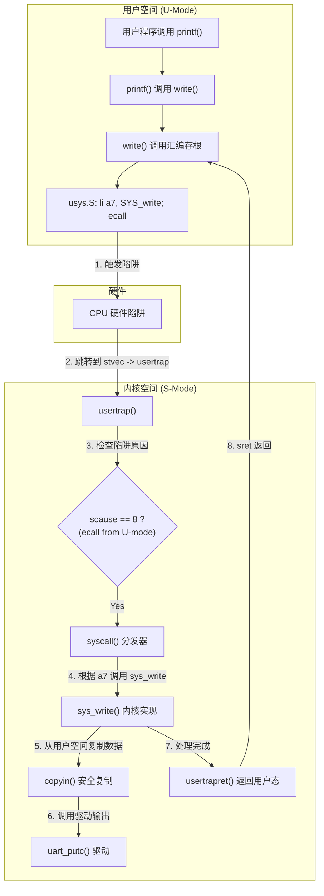

---

# 实验六：系统调用

**姓名**：李璋平
**学号**：2023302051087
**日期**：2025-12-16

## 一、实验概述
注：由于实际上lab6是最后一个完成的实验，所以这个文件夹里的是整个实验的最终版本（也包括后面的lab7和扩展项目）
### 实验目标

本次实验的核心目标是构建一个完整的系统调用机制，打通用户态程序与操作系统内核之间的交互通道。主要任务包括：
1.  设计一套系统调用接口，包括用户态的存根函数和内核态的实现。
2.  实现内核态的系统调用分发器，能够根据系统调用号调用正确的内核服务函数。
3.  实现参数在用户态和内核态之间的安全传递，特别是对指针和缓冲区的处理。
4.  实现一个简单的用户态 shell 程序，用于测试和演示系统调用功能。

### 完成情况

- ✅ **用户态接口 (`usys.S`, `user.h`)**: 成功定义了系统调用号，并通过汇编实现了用户态存根函数，负责将调用号放入 `a7` 寄存器并执行 `ecall`。
- ✅ **陷入机制 (`usys.S` -> `usertrap`)**: 成功实现了用户程序通过 `ecall` 陷入内核 `usertrap` 处理函数的流程。
- ✅ **内核分发器 (`syscall.c`)**: 成功实现了 `syscall()` 函数，它能从 `trapframe` 中获取系统调用号，并通过函数指针数组调用对应的内核实现。
- ✅ **参数安全传递**: 成功实现了 `copyin` 和 `copyout` 函数，用于在用户虚拟地址空间和内核之间安全地复制数据，防止内核直接访问无效或恶意的用户指针。
- ✅ **核心系统调用实现**: 成功实现了 `fork`, `exit`, `wait`, `getpid`, `read`, `write` 等关键系统调用。
- ✅ **用户 Shell 程序**: 成功编写了一个功能性的 shell，能够接收命令并调用系统调用来执行测试套件。

### 开发环境

- **操作系统**: Ubuntu 22.04.5 LTS
- **工具链 (GCC)**: riscv64-unknown-elf-gcc 12.2.0
- **模拟器 (QEMU)**: 8.2.0

---

## 二、技术设计

### 1. 系统调用完整流程

系统调用是一个跨越用户态和内核态的复杂流程，需要确保提供正确功能的同时维护系统安全。



**流程说明**:
1.  **用户态请求**: 用户程序调用一个库函数（如 `printf`），该函数最终调用一个系统调用包装函数（如 `write`）。
2.  **陷入内核**: `write` 函数跳转到 `usys.S` 中的汇编代码，该代码将系统调用号（`SYS_write`）加载到 `a7` 寄存器，然后执行 `ecall` 指令。
3.  **硬件陷阱**: `ecall` 指令触发一个同步异常，CPU硬件自动切换到S-mode，并跳转到 `stvec` 指向的 `usertrap` 入口。
4.  **内核处理**:
    *   `usertrap` 发现 `scause` 为8（来自U-mode的ecall），于是调用 `syscall()` 分发器。
    *   `syscall()` 从当前进程 `trapframe` 的 `a7` 字段中读取系统调用号。
    *   通过函数指针数组 `syscalls[]`，调用对应的内核实现函数，如 `sys_write()`。
    *   `sys_write()` 使用 `copyin` 从用户提供的指针地址安全地复制数据到内核缓冲区，然后调用硬件驱动 `uart_putc` 输出。
5.  **返回用户态**: `sys_write` 执行完毕后，将返回值存入 `trapframe` 的 `a0` 字段。控制权返回到 `usertrap`，最终通过 `usertrapret` 机制恢复用户上下文并 `sret` 回到用户态。

### 2. 关键机制：用户/内核边界与安全数据拷贝

内核不能直接相信用户程序传递过来的指针。一个恶意的用户指针可能指向内核的关键数据结构，如果内核直接解引用，将导致系统崩溃或安全漏洞。

-   **核心思想**: 内核只在自己的地址空间中操作数据。所有需要跨边界传输的数据都必须经过严格的、逐字节的验证和复制。
-   **`copyin(pagetable, dst, srcva, len)`**:
    1.  接收一个内核目标地址 `dst` 和一个用户虚拟源地址 `srcva`。
    2.  对 `srcva` 的每一页，使用 `walk` 函数在**用户页表** (`pagetable`) 中查找对应的物理地址。
    3.  在查找过程中，严格检查PTE的 `PTE_V` (有效) 和 `PTE_U` (用户可访问) 标志。任何一个不满足，都意味着这是一次非法的内存访问，立即返回错误。
    4.  验证通过后，才从计算出的物理地址将数据复制到内核缓冲区 `dst`。
-   **`copyout(pagetable, dstva, src, len)`**:
    -   逻辑与 `copyin` 类似，但方向相反。它会额外检查PTE的 `PTE_W` (可写) 标志，确保用户内存是可写的。
### **3.关键数据结构：`trapframe`**

`trapframe`是连接用户态和内核态的**核心数据结构**，是实现中断、异常和系统调用的物理基础。当用户程序执行 `ecall` 陷入内核时，硬件和内核的汇编代码会立即将用户程序的所有寄存器状态完整地“快照”到这个结构体中。

```c
// trap.h

// trapframe 结构体 - xv6布局
// 这个结构体在 trampoline.s 中被填充，并作为参数传递给 C 语言的 trap 处理函数
// IMPORTANT: 必须和xv6保持完全一致的布局！
struct trapframe {
    // Kernel fields FIRST (accessed by trampoline code)
    /*   0 */ uint64_t kernel_satp;   // kernel page table
    /*   8 */ uint64_t kernel_sp;     // top of process's kernel stack
    /*  16 */ uint64_t kernel_trap;   // usertrap()
    /*  24 */ uint64_t epc;           // saved user program counter
    /*  32 */ uint64_t kernel_hartid; // saved kernel tp (not used yet)

    // User registers (saved/restored by trampoline)
    /*  40 */ uint64_t ra;
    /*  48 */ uint64_t sp;
    /*  56 */ uint64_t gp;
    /*  64 */ uint64_t tp;
    /*  72 */ uint64_t t0;
    /*  80 */ uint64_t t1;
    /*  88 */ uint64_t t2;
    ...
```

**在系统调用中的关键作用**:

-   **`a7` (系统调用号)**: 当用户程序执行 `ecall` 时，内核通过读取 `p->trapframe->a7` 得知用户请求的是哪一项服务（如 `SYS_write`）。这是 `syscall()` 分发器的决策依据。
-   **`a0` - `a6` (参数传递)**: 用户程序将系统调用的参数放入 `a0` 到 `a6` 寄存器中。内核通过读取 `p->trapframe->a0`、`p->trapframe->a1` 等来获取这些参数。
-   **`a0` (返回值)**: 内核服务例程执行完毕后，会将返回值写入 `p->trapframe->a0`。当通过 `sret` 返回用户空间时，硬件会从 `trapframe` 中恢复所有寄存器，用户程序便能在 `a0` 寄存器中得到系统调用的结果。
-   **`epc` (返回地址)**: 对于 `ecall`，`epc` 保存了 `ecall` 指令的地址。内核在 `usertrap` 中必须将其加 4 (`p->trapframe->epc += 4;`)，否则当从系统调用返回时，程序会再次执行 `ecall` 指令，陷入无限循环。
---

## 三、实现细节与关键代码

### 1. 关键代码：`user/usys.S` - 系统调用存根

这是用户态和内核态之间的“桥梁”。每个系统调用在用户空间都有一个对应的汇编存根。

```assembly
# 系统调用包装 - 汇编实现
# 每个系统调用函数将系统调用号放入a7，然后执行ecall

.global write
write:
    li a7, 7        # SYS_write
    ecall
    ret

.global getpid
getpid:
    li a7, 4        # SYS_getpid
    ecall
    ret

# ... (其他系统调用的实现) ...
```
**实现要点**:
-   **ABI 约定**: 遵循 RISC-V 调用约定，将系统调用号放入 `a7` 寄存器，参数放入 `a0-a6`，返回值通过 `a0` 返回。
-   **简洁性**: 每个存根函数都只做两件事：加载立即数和执行 `ecall`。这使得添加新的系统调用非常简单。

### 2. 关键代码：`proc/syscall.c/syscall()` - 内核分发器

这是内核中处理系统调用的“总指挥室”。

```c
// 系统调用函数指针数组
static uint64_t (*syscalls[])(void) = {
    [SYS_fork]        = (uint64_t (*)())fork,
    [SYS_exit]        = (uint64_t (*)())exit,
    [SYS_wait]        = (uint64_t (*)())wait,
    [SYS_getpid]      = (uint64_t (*)())getpid,
    [SYS_read]        = sys_read,
    [SYS_write]       = sys_write,
    // ...
};

void syscall(void) {
    int num;
    struct proc *p = myproc();

    // 1. 从 trapframe 中获取系统调用号 (由 usys.S 放入 a7)
    num = p->trapframe->a7;

    // 2. 检查调用号是否有效，并调用对应的内核函数
    if (num > 0 && num < (sizeof(syscalls)/sizeof(syscalls[0])) && syscalls[num]) {
        // 3. 将内核函数的返回值存回 trapframe->a0，以便返回给用户
        p->trapframe->a0 = syscalls[num]();
    } else {
        printf("unknown syscall %d\n", num);
        p->trapframe->a0 = -1; // 返回错误
    }
}
```
**实现要点**:
-   **表驱动**: 使用函数指针数组 `syscalls[]` 是一种高效的设计模式。它使得添加、删除或修改系统调用变得非常容易，只需要修改这个数组即可，无需改变分发逻辑。
-   **参数传递**: 参数的传递是隐式的。`syscall()` 本身不处理参数，而是由具体的实现函数（如 `sys_write`）自行从 `myproc()->trapframe->a0`、`a1` 等字段中提取。

### 3. 关键代码：系统调用实现举例：`sys_write()` 与 `copyin`

`sys_write` 是一个典型的需要处理用户指针的系统调用，它展示了如何与 `copyin` 协作。

```c
uint64_t sys_write(void) {
    struct proc *p = myproc();
    // 1. 从 trapframe 中提取参数
    int fd = p->trapframe->a0;
    uint64_t buf_addr = p->trapframe->a1; // 这是用户虚拟地址
    int n = p->trapframe->a2;

    // (省略 fd 检查)

    char kernel_buf[256]; // 在内核栈上创建一个安全的缓冲区
    
    // ... (循环处理大数据) ...
    int chunk = n > 256 ? 256 : n;

    // 2. 使用 copyin 安全地从用户空间复制数据
    if (copyin(p->pagetable, kernel_buf, buf_addr, chunk) < 0) {
        return -1; // 复制失败 (无效地址)
    }

    // 3. 在内核空间安全地操作数据
    for (int i = 0; i < chunk; i++) {
        uart_putc(kernel_buf[i]);
    }

    return n; // 返回成功写入的字节数
}
```
**实现要点**:
-   **不信任**: `sys_write` 从不直接使用 `buf_addr`。它总是先通过 `copyin` 将数据复制到内核自己的、绝对安全的 `kernel_buf` 中。
-   **职责分离**: `sys_write` 负责业务逻辑（写到哪个文件），而 `copyin` 负责跨特权级数据传输的安全性。这种分离使得代码更清晰、更安全。


### **4.关键代码：`trap/trampoline.s` - 用户/内核切换的跳板**

`trampoline.s` 文件中的代码位于一个特殊的物理页上，这个页在**内核页表**和**所有用户页表**中都被映射到了同一个固定的高虚拟地址（`TRAMPOLINE`）。这使得在切换页表时，PC可以安全地停留在这个“公共区域”，从而完成平滑的特权级与地址空间的转换。

```assembly
uservec:
    # 陷阱发生后，CPU跳转到这里，此时仍在使用用户页表
    # 1. 保存用户寄存器到 trapframe
    #    (a0临时存入sscratch, 以便加载TRAPFRAME地址)
    csrw sscratch, a0
    li a0, 0x3fffffe000  # TRAPFRAME 虚拟地址
    sd ra, 40(a0)
    # ... (保存其他30个用户寄存器) ...
    csrr t0, sscratch
    sd t0, 112(a0)      # 保存原始的 a0

    # 2. 从 trapframe 中加载内核信息
    ld sp, 8(a0)       # 内核栈顶 (kernel_sp)
    ld t1, 0(a0)       # 内核页表 (kernel_satp)
    ld t0, 16(a0)      # 内核陷阱处理函数 (kernel_trap)

    # 3. 切换到内核页表
    sfence.vma
    csrw satp, t1
    sfence.vma

    # 4. 跳转到C语言的 usertrap() 函数
    jr t0

.globl userret
userret:
    # 从内核返回时，usertrapret() 跳转到这里，此时仍在使用内核页表
    # a0 寄存器中传入了目标用户页表的 satp 值

    # 1. 切换回用户页表
    sfence.vma
    csrw satp, a0
    sfence.vma

    # 2. 从 trapframe 恢复所有用户寄存器
    li a0, 0x3fffffe000  # TRAPFRAME 虚拟地址
    ld ra, 40(a0)
    # ... (恢复其他30个用户寄存器) ...
    ld a0, 112(a0)      # 最后恢复 a0

    # 3. sret: 返回用户态
    #    硬件会自动恢复PC(从sepc), 特权级(U-mode), 中断状态(开启)
    sret
```
**实现要点**:
-   **双重映射**: `trampoline` 的核心在于它在内核和用户地址空间中的“存在感”，这是安全切换页表的前提。
-   **`uservec` (用户 -> 内核)**: 负责保存完整的用户态上下文，然后切换到内核页表和内核栈，最后跳转到 `usertrap`。
-   **`userret` (内核 -> 用户)**: 负责切换回用户页表，然后恢复完整的用户态上下文，最后执行 `sret` 指令，原子地返回到用户程序。

### **5.关键代码：`proc/userinit.c` - 创建第一个用户进程**

`userinit` 是内核中一个特殊函数，在系统初始化后期被调用，它的职责是“从无到有”地创建第一个用户进程，并为其准备好运行所需的一切。

```c
void userinit(void) {
    struct proc *p;

    // 1. 分配一个进程控制块
    p = allocproc();

    // 2. 创建一个独立的用户页表，并映射 trampoline 和 trapframe
    p->pagetable = uvmcreate();
    map_page(p->pagetable, TRAPFRAME, (uint64_t)p->trapframe, PTE_R | PTE_W);

    // 3. 为用户代码、数据和栈分配物理内存并映射
    uint64_t sz = 4 * PGSIZE; // 假设分配4页
    uvmalloc(p->pagetable, 0, sz);
    p->sz = sz;

    // 4. 将嵌入在内核中的用户程序二进制码 (shell) 复制到用户内存中
    extern unsigned char user_shell_bin[];
    extern unsigned int user_shell_bin_len;
    copyout_to_user(p->pagetable, 0, (char*)user_shell_bin, user_shell_bin_len);

    // 5. 设置 trapframe，为进程返回用户态做准备
    //    - epc: 用户程序的入口点
    //    - sp: 用户栈的栈顶地址
    p->trapframe->epc = 0x0;
    p->trapframe->sp = sz;

    // 6. 将进程状态设置为 RUNNABLE，让调度器可以选中它
    acquire(&ptable_lock);
    p->state = RUNNABLE;
    release(&ptable_lock);
}
```
**实现要点**:
-   **从0到1**: 这是系统从纯内核态到拥有第一个用户态进程的关键一步。
-   **构建地址空间**: `userinit` 精心构建了新进程的虚拟地址空间，包括分配物理内存、建立页表映射、加载程序代码。
-   **设置返回现场**: 通过设置 `trapframe` 的 `epc` 和 `sp`，它伪造了一个“中断现场”，使得这个新进程在第一次被调度时，能够通过 `usertrapret` 机制顺利“返回”到用户程序的入口点开始执行。

### **6.关键代码：`user/shell.c` - 简单的用户态Shell**

这是一个运行在用户态的、与用户交互的程序。它通过调用系统调用来与内核交互，执行用户命令。

```c
// User-space shell program
#include "user.h"

// 读取一行输入
int readline(char *buf, int max) {
    int i = 0;
    char c;
    while (i < max - 1) {
        // 调用 read 系统调用从标准输入(fd=0)读取一个字符
        if (read(0, &c, 1) != 1) break;

        if (c == '\n' || c == '\r') { // 遇到回车
            buf[i] = '\0';
            write(1, "\n", 1); // 调用 write 系统调用回显换行
            return i;
        }
        // ... (处理退格等) ...
        buf[i++] = c;
        write(1, &c, 1); // 回显输入的字符
    }
    buf[i] = '\0';
    return i;
}

// 主shell循环
int main(void) {
    char cmd[128];
    printf("RISC-V OS Shell\n");

    while (1) {
        printf("shell> ");
        readline(cmd, sizeof(cmd)); // 等待用户输入

        if (strcmp(cmd, "test") == 0) {
            // fork 一个子进程来运行测试
            int pid = fork();
            if (pid == 0) {
                // 子进程执行测试
                test_basic_syscalls();
                exit(0);
            } else {
                // 父进程等待子进程结束
                wait(0);
            }
        } 
        // ... (处理其他命令如 nice, help, exit) ...
    }
    exit(0);
}
```
**实现要点**:
-   **用户态视角**: `shell.c` 中的所有操作都是通过系统调用接口（如 `read`, `write`, `fork`, `exit`）完成的。它无法直接访问硬件或内核数据。
-   **交互循环**: `main` 函数的核心是一个 `while(1)` 循环，不断地“读取命令 -> 解析命令 -> 执行命令”，这是所有命令行界面的基本模型。
-   **进程创建**: 执行 `test` 命令时，shell 通过 `fork` 创建一个子进程来运行测试套件，并通过 `wait` 等待其完成。这展示了系统调用的典型使用场景。