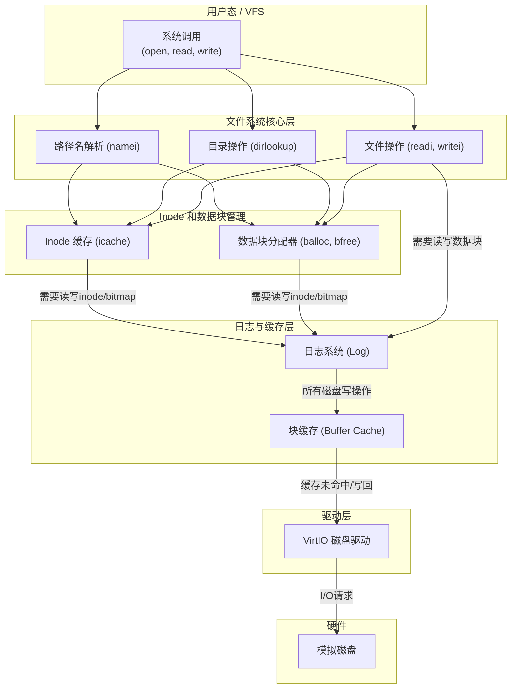

---

# 实验七：文件系统

**姓名**：李璋平
**学号**：2023302051087
**日期**：2025-12-16

## 一、实验概述

### 实验目标

本次实验的核心目标是构建一个功能完整、基于 inode 的日志文件系统。这涉及到操作系统中最为复杂和庞大的子系统之一。主要任务包括：
1.  **磁盘驱动**：实现一个 `virtio-blk` 驱动，使内核能够与 QEMU 模拟的磁盘进行块读写操作。
2.  **块缓存 (Buffer Cache)**：设计并实现一个块缓存层，用于减少磁盘I/O次数，提升性能。
3.  **日志系统 (Logging)**：实现一个简单的写前日志（Write-Ahead Logging）系统，以保证文件系统在意外崩溃后的一致性。
4.  **文件系统核心层**：实现基于 `inode` 的文件表示、数据块位图管理（`balloc`/`bfree`）、目录操作和路径名解析。
5.  **mkfs工具**：编写一个用户态工具 `mkfs`，用于创建和格式化文件系统镜像。

### 完成情况

- ✅ **VirtIO磁盘驱动**: 成功实现了 `virtio_disk_init` 和 `virtio_disk_rw`，能够与 QEMU 模拟磁盘进行通信。
- ✅ **块缓存**: 成功实现了 `binit`, `bread`, `bwrite`, `brelse`，构建了一个基于 LRU 策略的块缓存。
- ✅ **日志系统**: 成功实现了 `loginit`, `begin_op`, `end_op`, `log_write`，为文件系统操作提供了原子性和崩溃恢复能力。
- ✅ **Inode 和数据块管理**: 成功实现了 `ialloc`, `iget`, `iput` 等 inode 缓存和分配机制，以及 `balloc`, `bfree` 数据块位图管理。
- ✅ **目录与路径解析**: 成功实现了 `dirlookup`, `dirlink` 等目录操作，以及 `namex` 路径名解析。
- ✅ **mkfs 工具**: 成功编写了 `mkfs.c`，能够生成一个包含根目录和初始文件的文件系统镜像。

### 开发环境

- **操作系统**: Ubuntu 22.04.5 LTS
- **工具链 (GCC)**: riscv64-unknown-elf-gcc 12.2.0
- **模拟器 (QEMU)**: 8.2.0

---

## 二、技术设计

### 1. 文件系统分层架构

本次实验的文件系统是一个典型的分层结构，每一层都为其上层提供清晰的抽象接口，同时隐藏了底层的实现细节。



**数据流与控制流**:
-   **读操作**: 一个 `read` 系统调用会通过 `namex` 找到文件 `inode`，然后 `readi` 计算出需要的数据块号，通过 `bread` 请求块缓存。如果缓存未命中，`bread` 会调用 `virtio_disk_rw` 从磁盘读取数据块到缓存中，然后返回给上层。
-   **写操作**: 一个 `write` 系统调用在修改 inode、位图或数据块时，并**不直接写入磁盘**。而是将修改后的块标记为“脏”，并通过 `log_write` 将其**记录在日志中**。只有在整个系统调用（一个事务）结束时，`end_op` 才会触发 `commit`，将日志写入磁盘，然后再安全地将数据写回文件系统的最终位置。

### 2. 磁盘布局

文件系统镜像在磁盘上的布局是固定的，由超级块定义。

| 块 0       | 块 1         | 块 2...31 (Log) | 块 32...57 (Inodes) | 块 58... (Bitmap) | 块 ...999 (Data Blocks) |
| :--------- | :----------- | :-------------- | :------------------ | :---------------- | :---------------------- |
| (未使用) | **Superblock** | 日志区          | Inode 表            | 数据块位图        | 数据块                  |

-   **Superblock**: 存储文件系统的元数据，如总块数、inode数量、日志区起始位置等。
-   **Log**: 日志区，用于崩溃恢复。
-   **Inodes**: 存放所有文件的 `dinode` 结构。
-   **Bitmap**: 一个位图，每一位对应一个数据块，用于标记该块是否被使用。
-   **Data Blocks**: 存放文件内容的实际数据。

### 3. 核心机制

#### 机制一：写前日志 (Write-Ahead Logging)
为防止在文件系统操作（如创建文件，可能涉及修改目录、inode、位图等多个块）进行到一半时系统崩溃导致不一致，采用了日志系统。
1.  **`begin_op()`**: 标志一个事务的开始。
2.  **`log_write(buf)`**: 任何对磁盘块的修改，都先不写入原始位置，而是将 `buf` 的块号记录在内存的日志头中。
3.  **`end_op()` -> `commit()`**: 事务结束时，执行提交：
    a.  **写日志 (Write Log)**: 将所有被 `log_write` 记录的“脏”块，从块缓存复制到磁盘上的**日志区域**。
    b.  **写日志头 (Write Header)**: 将包含这些块号的日志头写入磁盘。这是**原子提交点**。一旦完成，事务就被视为已提交。
    c.  **安装 (Install)**: 将日志区域中的数据块，逐个复制到它们在文件系统中**真正的最终位置**。
    d.  **清除日志 (Clear Log)**: 清空日志头，标记事务完成。
-   **崩溃恢复**: 系统启动时，`recover_from_log` 会检查日志头。如果日志头表示有一个已提交但可能未完成安装的事务，它会重新执行“安装”步骤，从而保证文件系统的一致性。

#### 机制二：块缓存
为了避免频繁的、缓慢的磁盘I/O，我们在内存中维护了一个磁盘块的缓存。
-   **数据结构**: 一个双向链表 `bcache`，用于实现 **LRU (Least Recently Used)** 替换策略。
-   **`bread(dev, blockno)`**:
    1.  在 `bcache` 中查找请求的块。
    2.  如果找到（命中），增加其引用计数并返回。
    3.  如果未找到（未命中），则从 `bcache` 链表的尾部（LRU端）找到一个未被引用的缓存块，将其重新分配给新的 `blockno`，然后从磁盘读取数据，最后返回。
-   **`brelse(buf)`**: 当上层代码使用完一个缓存块后，调用此函数减少其引用计数。当引用计数为0时，该块被移动到链表头部（MRU端），表示它最近被使用过。

#### 关键数据结构
文件系统的实现围绕着几个核心数据结构展开，它们定义了文件系统在磁盘上的布局和在内存中的表示。

#### **1. `superblock` - 文件系统的元数据**

`superblock`（超级块）是整个文件系统的“说明书”。它位于磁盘的固定位置（本实验中是块1），包含了描述文件系统整体布局和规模的所有元数据。内核在挂载文件系统时首先读取它，以了解如何解析后续的数据。

```c
// fs.h - 超级块结构
struct superblock {
    uint32_t magic;           // 文件系统魔数 (e.g., 0x12345678), 用于识别文件系统类型
    uint32_t size;            // 文件系统总块数
    uint32_t nblocks;         // 可用的数据块数量
    uint32_t ninodes;         // Inode 的总数量
    uint32_t nlog;            // 日志区域占用的块数

    // 各个区域的起始块号
    uint32_t logstart;        // 日志区起始块号
    uint32_t inodestart;      // Inode 表起始块号
    uint32_t bmapstart;       // 数据块位图起始块号
};
```
**设计要点**:
-   **魔数**: 这是一个关键字段，用于快速验证磁盘上的数据是一个认识的文件系统，防止内核错误地挂载和解析一个未知格式的磁盘。
-   **布局信息**: `logstart`, `inodestart`, `bmapstart` 等字段精确定义了文件系统各个重要区域在磁盘上的起始位置。内核依赖这些值来定位 inode、数据块位图等。

#### **2. `inode` - 文件的标识**

`inode` 是文件系统中表示一个文件或目录的核心数据结构。它存储了除文件名和内容之外的所有元数据。文件名被存储在目录项中，而文件内容则存储在数据块中。`inode` 在磁盘和内存中有两种不同的表现形式。

##### **磁盘上的 inode: `struct dinode`**

这是 `inode` 存储在磁盘上的紧凑格式，只包含持久化的信息。

```c
// fs.h - 磁盘上的 inode 结构
struct dinode {
    uint16_t type;            // 文件类型 (T_FILE, T_DIR, T_DEVICE)
    uint16_t nlink;           // 硬链接数量 (当 nlink=0 时，文件可被回收)
    uint32_t size;            // 文件大小（以字节为单位）
    uint32_t addrs[DIRECT_BLOCKS + 1];  // 数据块地址数组
                                      // 前12个是直接块，最后一个是一级间接块
};
```

##### **内存中的 inode: `struct inode`**

这是 `inode` 被加载到内存后的格式。它包含了 `dinode` 的所有信息，并增加了内核在运行时需要的状态，如引用计数和锁。

```c
// fs.h - 内存中的 inode
struct inode {
    uint32_t dev;             // 所在的设备号
    uint32_t inum;            // inode 编号

    // 运行时状态
    int ref;                  // 内存中的引用计数
    int valid;                // 标记 inode 数据是否已从磁盘加载
    struct spinlock lock;     // 用于保护 inode 内容的锁

    // 从磁盘 dinode 复制的内容
    uint16_t type;
    uint16_t nlink;
    uint32_t size;
    uint32_t addrs[DIRECT_BLOCKS + 1];
};
```
**设计要点**:
-   **数据块指针 `addrs`**: 这是 `inode` 的核心。通过一个由直接块指针和一级间接块指针组成的数组，一个 `inode` 可以索引到文件的数据。这种设计很好地平衡了小文件的访问效率（直接块）和大文件的存储能力（间接块）。
-   **内存/磁盘分离**: 将 `inode` 分为 `dinode` 和 `inode` 两种结构，清晰地分离了持久化状态和运行时状态。`ref` (引用计数) 只存在于内存中，它用于管理 `icache` (inode 缓存)，防止正在被使用的 inode 被从内存中回收。

#### **3. `buf` - 块缓存**

`struct buf` (buffer) 是磁盘块在内存中的表示。块缓存层通过管理一个 `buf` 结构的池，来减少对慢速磁盘的直接访问。

```c
// fs.h - 块缓存结构
struct buf {
    int valid;                // 缓存数据是否有效 (是否已从磁盘读取)
    int disk;                 // 缓存数据是否为脏 (是否需要写回磁盘)
    uint32_t dev;             // 设备号
    uint32_t blockno;         // 对应的磁盘块号
    uint32_t refcnt;          // 引用计数 (有多少个内核任务正在使用此缓存)

    // LRU (Least Recently Used) 链表指针
    struct buf *prev, *next;
    
    struct spinlock lock;     // 保护缓存块内容的锁
    
    // 实际数据
    unsigned char data[BLOCK_SIZE];
};
```
**设计要点**:
-   **LRU 链表**: 所有的 `buf` 结构通过 `prev` 和 `next` 指针连接成一个双向链表。当需要替换缓存时，系统会从链表尾部（最近最少使用的一端）寻找一个 `refcnt` 为0的 `buf` 来重用。
-   **引用计数 `refcnt`**: 这是确保数据一致性的关键。一个内核任务在读取或修改一个 `buf` 之前，必须先增加其 `refcnt`。只要 `refcnt` 大于0，这个 `buf` 就不会被替换策略回收，即使它位于LRU链表的末尾。
-   **`valid` 和 `disk` 标志**:
    -   `valid`: 当一个 `buf` 刚被分配但还未从磁盘读取数据时，`valid` 为0。`bread` 函数会检查此位，如果为0，则发起磁盘读操作。
    -   `disk`: 当一个 `buf` 的内容被修改后，`disk` 位被置为1。日志系统或后台同步进程会扫描这些“脏”块，并将它们写回磁盘。

#### **4. `log` - 日志系统状态**
日志系统是保证文件系统崩溃一致性的核心。它围绕着 `struct log` 和 `struct logheader` 这两个数据结构构建。

#### **`struct logheader` - 磁盘上的日志记录**

这是存储在磁盘日志区第一个块（头块）的数据结构。它简明地记录了当前事务中包含哪些被修改的磁盘块。
```c
// fs.h - 日志头结构
struct logheader {
    int n;                      // 日志中有效块的数量
    int block[LOGSIZE];         // 存储每个日志块在文件系统中的原始块号
};
```
**设计要点**:
-   **`n` 字段**: `n` 的值是事务状态的关键。如果 `n > 0`，表示有一个已提交但可能未完全安装的事务，系统在重启时需要进行恢复。如果 `n = 0`，则表示日志是干净的。
-   **`block` 数组**: 这个数组建立了一个映射关系：`log.start + 1 + i` (日志区中的第i个数据块) 对应的数据，应该被写到磁盘块号为 `block[i]` 的最终位置。

#### **`struct log` - 内存中的日志状态**
这是一个纯粹存在于内存中的结构体，用于管理日志系统的当前状态，如事务的并发控制、提交状态等。

```c
// log.c - 内存中的日志状态结构
struct log {
    struct spinlock lock;     // 保护整个日志系统的锁
    int start;                // 日志区在磁盘上的起始块号
    int size;                 // 日志区总大小（块数）
    int dev;                  // 设备号

    // 事务状态变量
    int outstanding;          // 正在进行的文件系统调用（事务）数量
    int committing;           // 标志位，表示是否正在进行提交操作

    // 内存中的日志头缓存
    struct logheader lh;
};
```
**设计要点**:
-   **`outstanding` 计数器**: 允许多个文件系统调用**并发地**加入到**同一个**事务中。例如，一个进程创建文件，另一个进程删除文件，它们的操作可以被合并到一次日志提交中，提高了效率。
-   **`committing` 标志**: 这是一个互斥标志，确保在任何时刻只有一个进程可以执行 `commit` 操作。当一个进程发现 `outstanding` 降为0并准备提交时，它会设置此标志，阻止新的文件系统调用（`begin_op`）开始，直到提交完成。

---

## 三、实现细节与关键代码

### 1. 关键代码：`virtio_disk_rw()` - 磁盘驱动核心

这是与硬件交互的核心。它通过 VirtIO 协议，使用描述符、可用环和已用环来异步提交一个读/写请求。

```c
void virtio_disk_rw(char *buf, uint32_t blockno, int write) {
    // ... (获取锁) ...
    
    // 1. 分配三个描述符：请求头、数据、状态
    int idx[3];
    alloc3_desc(idx);

    // 2. 填充描述符
    //    - 描述符0: virtio_blk_req 结构体 (包含操作类型和扇区号)
    //    - 描述符1: 数据缓冲区 (buf)
    //    - 描述符2: 单字节的状态缓冲区
    disk.desc[idx[0]].addr = (uint64_t)&disk.info[idx[0]].req;
    // ...
    disk.desc[idx[1]].addr = (uint64_t)buf;
    // ...
    disk.desc[idx[2]].addr = (uint64_t)&disk.info[idx[0]].status;
    // ...

    // 3. 将描述符链的头索引放入可用环
    disk.avail->ring[disk.avail->idx % NUM_DESC] = idx[0];
    __sync_synchronize(); // 内存屏障
    disk.avail->idx++; // 更新索引
    __sync_synchronize();

    // 4. 通知设备有新的请求
    virtio_write32(VIRTIO0 + VIRTIO_MMIO_QUEUE_NOTIFY, 0);

    // 5. 忙等待，直到设备完成操作 (状态字节被设备写入非0xff)
    while(disk.info[idx[0]].status == 0xff)
        ;

    // ... (释放描述符和锁) ...
}
```
**实现要点**:
-   **协议驱动**: 代码严格遵循 VirtIO 规范，通过MMIO寄存器和共享内存（描述符表和环）与模拟设备通信。
-   **异步模拟**: 尽管代码中使用忙等待来模拟同步操作，但其底层的描述符机制是为异步I/O设计的。在中断驱动的版本中，第5步会被替换为睡眠，直到磁盘中断发生。

### **2. 关键代码：日志写入与提交**

#### **1. `log_write()` - 记录一个脏块**
任何可能修改磁盘的操作（如 `iwrite`, `balloc`）都不会直接调用 `bwrite`。相反，它们会调用 `log_write` 来“吸收”这个写操作。

```c
// log.c - 将一个修改过的缓存块添加到当前事务中
void log_write(struct buf *b) {
    int i;
    
    // ... (省略容量和状态检查) ...

    acquire(&log.lock);

    // 1. 检查这个块是否已经在本事务中被记录
    for (i = 0; i < log.lh.n; i++) {
        if (log.lh.block[i] == b->blockno)
            break; // 已存在，无需重复添加
    }

    // 2. 如果是新块，将其块号添加到日志头中
    log.lh.block[i] = b->blockno;
    if (i == log.lh.n) {
        log.lh.n++; // 增加日志中的块数
    }

    // 3. 标记缓存块为“脏”，以便 bwrite 最终能将其写入
    b->disk = 1;
    
    release(&log.lock);
}
```
**实现要点**:
-   **吸收写操作**: `log_write` 的核心作用是**延迟**并**记录**写操作。它只是将块号记在内存中的 `log.lh` 里，真正的磁盘写入被推迟到 `commit` 阶段。
-   **去重**: 循环检查确保了即使同一个块在一个事务中被多次修改，它在日志中也只占用一个位置，节省了日志空间。

#### **2. `write_log()` - 将脏块写入日志区**

这是 `commit` 过程的第一步，负责将内存中所有被记录的脏块的**当前内容**，复制到磁盘上的**日志区域**。

```c
// log.c - 将缓存中的脏块内容复制到磁盘上的日志区
static void write_log(void) {
    int tail;

    for (tail = 0; tail < log.lh.n; tail++) {
        // 目标：日志区的第 (tail+1) 个块 (第0个是头块)
        struct buf *to = bread(log.dev, log.start + tail + 1);
        
        // 源：文件系统中原始块号对应的缓存块
        struct buf *from = bread(log.dev, log.lh.block[tail]);

        // 核心：内存到内存的复制，然后写入磁盘
        memcpy(to->data, from->data, BLOCK_SIZE);
        bwrite(to);  // 将日志块写入磁盘

        brelse(from);
        brelse(to);
    }
}
```
**实现要点**:
-   **两阶段写入**: 这是一个典型的两阶段过程。首先，通过 `bread` 将源数据和目标位置都加载到块缓存中。然后，在内存中进行 `memcpy`。最后，通过 `bwrite` 将包含新内容的目标缓存块（`to`）写入磁盘。
-   **不修改原始位置**: 这一步操作的磁盘写入**全部发生在日志区**，文件系统在磁盘上的原始数据块在此时仍保持不变，这是写前日志（Write-Ahead）的关键。
这是保证文件系统一致性的核心逻辑。

#### **3. `commit()` - 事务提交**
```c
static void commit() {
    if (log.lh.n > 0) {
        // 步骤 a: 将所有脏块从缓存写入磁盘的日志区域
        write_log();
        
        // 步骤 b: 将日志头写入磁盘 (原子提交点)
        // 一旦这步完成，即使崩溃，重启后也能恢复
        write_head();
        
        // 步骤 c: 将日志中的数据安装到文件系统的最终位置
        install_trans();
        
        // 步骤 d: 清除日志头，标记事务完成
        log.lh.n = 0;
        write_head();
    }
}
```
**实现要点**:
-   **崩溃安全**: 这个函数的执行顺序至关重要。如果在 `write_head` 之后、`install_trans` 完成之前崩溃，重启后的 `recover_from_log` 会重新执行 `install_trans`，保证数据最终被写入正确位置。如果在 `write_head` 之前崩溃，日志被视为无效，文件系统状态回滚到事务开始前。


### **3.关键代码：Inode和数据块管理**
文件系统的核心任务之一是管理存储资源，即 inode 和数据块。这通过 `ialloc`（分配 inode）和 `balloc`/`bfree`（分配/释放数据块）来完成。

#### **`ialloc()` - 分配一个空闲 Inode**

`ialloc` 负责在磁盘的 inode 区域中找到一个未被使用的 `dinode`，将其初始化，并返回一个指向该 inode 的内存中 `struct inode` 的指针。

```c
// inode.c - 分配一个新的 inode
struct inode* ialloc(uint32_t dev, short type) {
    struct buf *bp;
    struct dinode *dip;

    // 1. 线性扫描 inode 表
    //    从 inode 1 开始 (0 保留) 遍历所有可能的 inode
    for (uint32_t inum = 1; inum < sb.ninodes; inum++) {
        // a. 计算 inum 所在的磁盘块号
        uint32_t block = sb.inodestart + inum / (BLOCK_SIZE / sizeof(struct dinode));
        
        // b. 读取该块到块缓存
        bp = bread(dev, block);
        if (bp == 0) continue;

        // c. 定位到块内的具体 dinode
        dip = (struct dinode*)bp->data + (inum % (BLOCK_SIZE / sizeof(struct dinode)));

        // 2. 检查 inode 类型是否为 0 (表示空闲)
        if (dip->type == 0) {
            // 3. 找到了！初始化它
            memset(dip, 0, sizeof(*dip));
            dip->type = type; // 设置文件类型
            
            // 4. 将修改后的块通过日志系统写入
            log_write(bp);
            brelse(bp);

            // 5. 返回这个新分配 inode 的内存表示
            return iget(dev, inum);
        }
        
        // 如果不是空闲的，释放缓存块并继续寻找
        brelse(bp);
    }

    printf("ialloc: no free inodes\n");
    return 0; // 没有找到空闲 inode
}
```
**实现要点**:
-   **线性扫描**: 这是最简单的 inode 分配策略。它从头到尾遍历 inode 表，找到第一个空闲项。虽然效率不高，但在一个简单的文件系统中是可行的。
-   **与块缓存和日志系统交互**: `ialloc` 并不直接写磁盘。它通过 `bread` 获取包含目标 inode 的块缓存，修改后，通过 `log_write` 将修改记录到日志中，然后通过 `brelse` 释放缓存块。

#### **2. `balloc()` 和 `bfree()` - 数据块位图管理**
这两个函数通过操作磁盘上的位图来管理数据块的分配和释放。位图中的每一位代表一个数据块的状态（0表示空闲，1表示已使用）。

##### **`balloc()` - 从位图中分配一个数据块**

```c
// inode.c - 从位图中分配一个数据块
uint32_t balloc(uint32_t dev) {
    struct buf *bp;
    int bi, m;
    uint32_t b;

    // 1. 遍历所有数据块位图块
    for (b = 0; b < sb.size; b += BLOCK_SIZE * 8) {
        // a. 读取包含当前范围数据块的位图块
        bp = bread(dev, BBLOCK(b, sb));
        if (bp == 0) continue;

        // 2. 在当前位图块中逐位查找
        for (bi = 0; bi < BLOCK_SIZE * 8 && b + bi < sb.size; bi++) {
            m = 1 << (bi % 8); // 计算当前位的掩码
            
            // 3. 检查该位是否为 0 (空闲)
            if ((bp->data[bi / 8] & m) == 0) {
                // 4. 找到了！将该位置 1
                bp->data[bi / 8] |= m;
                log_write(bp); // 记录修改
                brelse(bp);

                // 5. (可选但推荐) 清零新分配的数据块，防止数据泄漏
                struct buf *dbp = bread(dev, b + bi);
                if (dbp) {
                    memset(dbp->data, 0, BLOCK_SIZE);
                    log_write(dbp);
                    brelse(dbp);
                }

                // 6. 返回新分配的数据块号
                return b + bi;
            }
        }
        brelse(bp);
    }

    printf("balloc: out of blocks\n");
    return 0;
}
```

##### **`bfree()` - 释放一个数据块到- `BBLOCK` 宏**: 这个宏 `BBLOCK(b, sb)` 非常关键，它根据一个数据块号 `b` 和超级块 `sb` 的信息，能快速计算出管理这个数据块的位图存储在哪一个磁盘块中。
-   **位操作**: 通过位掩码 `m` 和位运算符 `&` (检查) `|` (置位) `&~` (清零)，函数高效地在字节级别操作位图。
-   **安全性**: `bfree` 在释放前会检查块是否确实处于“已分配”状态，防止重复释放。`balloc` 在分配后会清零数据块，防止旧数据意外地暴露给新文件。

#### **3.`iget()` 和 `iput()` - Inode 缓存管理**

这两个函数管理着内存中的活动 inode，类似于块缓存对磁盘块的管理。

```c
// 获取一个 inode, 可能从缓存或磁盘
struct inode* iget(uint32_t dev, uint32_t inum) {
    struct inode *ip, *empty;
    acquire(&icache.lock);

    // 1. 在缓存中查找活动的 inode
    for (ip = &icache.inode[0]; ip < &icache.inode[50]; ip++) {
        if (ip->ref > 0 && ip->dev == dev && ip->inum == inum) {
            ip->ref++; // 找到，增加引用计数
            release(&icache.lock);
            return ip;
        }
        if (empty == 0 && ip->ref == 0) empty = ip; // 记录一个空闲槽
    }

    // 2. 未找到，使用一个空闲槽
    if ((ip = empty) == 0) { /* ... panic ... */ }
    ip->dev = dev;
    ip->inum = inum;
    ip->ref = 1;
    ip->valid = 0; // 标记为无效，需要从磁盘加载
    initlock(&ip->lock, "inode");
    release(&icache.lock);
    
    // 调用者在返回后需要 ilock(ip) 来加载数据
    return ip;
}

// 释放对一个 inode 的引用
void iput(struct inode *ip) {
    acquire(&icache.lock);
    
    // 如果这是最后一个引用，并且文件的链接数也为0，则释放 inode 和其数据
    if (ip->ref == 1 && ip->valid && ip->nlink == 0) {
        // ... (加锁，调用 itrunc 释放数据块，清空 inode) ...
    }

    ip->ref--; // 减少引用计数
    release(&icache.lock);
}
```
**实现要点**:
-   **引用计数**: `ref` 字段是 inode 缓存管理的核心。只要一个 inode 的 `ref` 大于0，它就不会被回收，即使它在 LRU 链表的末尾。这防止了正在被使用的 inode 被意外替换。
-   **延迟加载**: `iget` 只是在缓存中分配一个槽位，并不会立即从磁盘读取 inode 数据。真正的读取操作被推迟到 `ilock(ip)` 中，这是一种常见的延迟加载优化。


### **4. 关键代码：`namex()` - 路径解析**

`namex` 负责将一个人类可读的路径字符串（如 `/usr/bin/ls`）转换为一个内存中的 `inode` 指针。

```c
struct inode* namex(char *path, int nameiparent, char *name) {
    struct inode *ip;

    // 根据路径是绝对还是相对，确定起始 inode
    if (*path == '/')
        ip = iget(ROOTDEV, ROOTINO); // 从根目录开始
    else
        ip = idup(myproc()->cwd); // 从当前工作目录开始 (简化版中也从根目录开始)

    // 循环解析路径的每一个部分 (e.g., "usr", "bin", "ls")
    while ((path = skipelem(path, name)) != 0) {
        ilock(ip);
        if (ip->type != T_DIR) { /* ... 错误处理 ... */ }
        
        // 如果是解析父目录且这是最后一部分，则直接返回
        if (nameiparent && *path == '\0') {
            iunlock(ip);
            return ip;
        }
        
        // 在当前目录 ip 中查找名为 name 的目录项
        int inum = dirlookup(ip, name, 0);
        if (inum < 0) { /* ... 未找到，错误处理 ... */ }
        
        // 释放当前 inode，获取下一个 inode
        iunlock(ip);
        iput(ip);
        ip = iget(ip->dev, inum);
    }
    
    // ... (根据 nameiparent 返回 ip 或 0) ...
    return ip;
}
```
**实现要点：**
-   **迭代解析**: `namex` 通过循环，逐级地深入目录树。在每一步中，它使用 `skipelem` 提取路径的一个组成部分，然后调用 `dirlookup` 在当前目录 `inode` 中查找该部分对应的 `inode` 号。
-   **锁与引用管理**: `namex` 的实现体现了对 inode 锁和引用计数的精细管理。在遍历每一步时，它都会锁定当前目录 `ip`，查找完成后解锁并释放对 `ip` 的引用 (`iput`)，然后获取对下一个 `inode` 的引用 (`iget`)。

### **5.关键代码：块缓存**
块缓存系统（`bio.c`）是文件系统与磁盘驱动之间的中间层，其核心目标是通过在内存中缓存磁盘块来减少昂贵的物理磁盘I/O操作。它围绕 `bget`, `bread` 和 `brelse` 这三个核心函数构建。

#### **1. `bget()` - 获取一个缓存块**

`bget` 是块缓存的“分配器”。它的职责是为给定的 `(dev, blockno)` 找到或分配一个**唯一的、锁定的**内存缓存块 `struct buf`。

```c
// bio.c - 在缓存中查找或分配一个块
static struct buf* bget(uint32_t dev, uint32_t blockno) {
    struct buf *b;

    acquire(&bcache.lock); // 保护 bcache 链表

    // 阶段 1: 缓存命中 (Cache Hit)
    // 遍历LRU链表，查找是否已存在该块的缓存
    for (b = bcache.head.next; b != &bcache.head; b = b->next) {
        if (b->dev == dev && b->blockno == blockno) {
            b->refcnt++; // 找到了，增加引用计数
            release(&bcache.lock);
            acquire(&b->lock); // 获取该 buf 的独立锁
            return b;
        }
    }

    // 阶段 2: 缓存未命中 (Cache Miss)，需要替换
    // 从链表尾部（LRU端）向前查找一个未被引用的块
    for (b = bcache.head.prev; b != &bcache.head; b = b->prev) {
        if (b->refcnt == 0) {
            // 找到了一个可重用的 buf
            b->dev = dev;
            b->blockno = blockno;
            b->valid = 0; // 标记数据为无效，需要从磁盘重新加载
            b->refcnt = 1;
            // (如果b是脏的，这里应该先把它写回磁盘)
            release(&bcache.lock);
            acquire(&b->lock);
            return b;
        }
    }

    // 阶段 3: 没有可用的缓存块
    release(&bcache.lock);
    printf("bget: no buffers available\n");
    return 0;
}
```
**实现要点**:
-   **两级锁**: `bget` 拥有并发控制。它首先获取全局的 `bcache.lock` 来安全地遍历和修改链表结构。一旦找到或分配了一个 `buf`，它就会在释放全局锁之前，获取这个 `buf` 自己的独立锁 `b->lock`。这样，调用者就可以在不阻塞其他进程访问缓存的情况下，安全地操作 `buf` 的 `data` 区域。
-   **LRU替换策略**: 当缓存未命中时，通过从链表尾部反向查找 `refcnt == 0` 的块，实现了经典的LRU（最近最少使用）页面替换算法。

#### **2. `bread()` - 读取一个块**

`bread` 是上层文件系统模块（如 `inode.c`）使用的主要接口。它封装了 `bget`，并确保返回的 `buf` 中包含有效的磁盘数据。

```c
// bio.c - 返回一个包含有效数据的锁定缓存块
struct buf* bread(uint32_t dev, uint32_t blockno) {
    struct buf *b;

    // 1. 获取一个与 (dev, blockno) 关联的锁定缓存块
    b = bget(dev, blockno);
    if (b == 0) {
        return 0;
    }

    // 2. 检查数据是否有效
    //    如果是新分配的 buf，valid 位为 0
    if (!b->valid) {
        // 数据无效，从磁盘读取
        disk_read(b);
        b->valid = 1; // 标记数据现在有效
    }

    // 3. 返回一个已锁定且包含有效数据的 buf
    return b;
}
```
**实现要点**:
-   **延迟加载**: `bread` 体现了延迟加载的思想。`bget` 只是分配了一个“坑位”，`bread` 负责检查这个“坑位”里是否有有效数据，如果没有，才真正触发磁盘I/O来填充它。

#### **3. `brelse()` - 释放一个缓存块**

当文件系统的某个部分使用完一个 `buf` 后，必须调用 `brelse` 来释放它，使其可以被其他任务使用或被LRU策略回收。

```c
// bio.c - 释放一个锁定的缓存块
void brelse(struct buf *b) {
    if (b->refcnt == 0) {
        // panic("brelse: releasing unreferenced buffer");
        return;
    }

    // 1. 释放对该 buf 内容的独占锁
    release(&b->lock);

    acquire(&bcache.lock); // 获取全局锁以修改 refcnt 和链表

    // 2. 减少引用计数
    b->refcnt--;
    
    // 3. 如果引用计数降为 0，则将该 buf 移动到 LRU 链表的头部 (MRU)
    //    这表示它刚刚被使用过，是“最新”的，不应该被立即替换。
    if (b->refcnt == 0) {
        // 从链表中移除
        b->next->prev = b->prev;
        b->prev->next = b->next;
        
        // 插入到链表头部
        b->next = bcache.head.next;
        b->prev = &bcache.head;
        bcache.head.next->prev = b;
        bcache.head.next = b;
    }

    release(&bcache.lock);
}
```
**实现要点**:
-   **引用计数**: `refcnt` 是 `brelse` 的核心。只有当 `refcnt` 减到 0 时，这个 `buf` 才真正变为空闲状态，并被移动到LRU链表的头部，等待未来的重用。如果多个任务同时引用同一个 `buf`，只有最后一个调用 `brelse` 的任务才会触发这个移动操作。
-   **LRU 更新**: 将 `refcnt` 为 0 的 `buf` 移动到链表头部，是 LRU 算法的关键一步。这确保了频繁被访问的块会一直停留在链表的前端，从而不容易被替换出去。


### **6.关键代码：`mkfs` - 文件系统创建工具**

`mkfs` 是一个运行在**宿主机**上的、独立的用户态程序。它从零开始创建一个符合文件系统规范的磁盘镜像文件。内核本身并不具备格式化磁盘的能力；它依赖于这个外部工具来准备好一个“开箱即用”的文件系统。

```c
// mkfs.c

// (省略头文件和数据结构定义)

int fsfd; // 文件系统镜像的文件描述符
struct superblock sb;
uint32_t freeinode = 1; // inode 0 未使用, root 是 1
uint32_t freeblock;     // 第一个空闲数据块的块号

// 主函数
int main(int argc, char *argv[]) {
    // ... (参数检查和打开文件) ...

    // 1. 计算并设置超级块参数
    sb.magic = FS_MAGIC;
    sb.size = 1000;       // 总块数
    sb.ninodes = 200;     // Inode 数量
    sb.nlog = 30;         // 日志块数量
    // 计算各个区域的起始块号
    sb.logstart = 2;
    sb.inodestart = sb.logstart + sb.nlog;
    sb.bmapstart = sb.inodestart + (sb.ninodes + IPB - 1) / IPB;
    freeblock = sb.bmapstart + (sb.size + BPB - 1) / BPB;

    // 2. 将整个磁盘镜像文件填充为零
    for (int i = 0; i < sb.size; i++) {
        wsect(i, zeroes);
    }

    // 3. 将配置好的超级块写入磁盘块 1
    char buf[BLOCK_SIZE];
    memset(buf, 0, BLOCK_SIZE);
    memcpy(buf, &sb, sizeof(sb));
    wsect(1, buf);

    // 4. 创建根目录 (inode 1)
    uint32_t rootino = ialloc(T_DIR);
    // 为根目录创建 "." 和 ".." 目录项
    struct dirent de;
    de.inum = rootino; strncpy(de.name, ".", MAX_NAME_LEN);
    iappend(rootino, &de, sizeof(de));
    de.inum = rootino; strncpy(de.name, "..", MAX_NAME_LEN);
    iappend(rootino, &de, sizeof(de));
    
    // 5. 最后，根据已使用的块数量，生成并写入位图
    balloc(freeblock);

    close(fsfd);
    printf("File system image created successfully.\n");
    exit(0);
}

// 将数据追加到 inode
void iappend(uint32_t inum, void *xp, int n) {
    char *p = (char*)xp;
    struct dinode din;
    rinode(inum, &din); // 读取 inode

    // ... (省略复杂的块分配逻辑) ...
    // 核心思想：
    // 1. 根据当前文件大小 din.size 计算出要写入的块号 fbn 和块内偏移
    // 2. 如果 fbn < DIRECT_BLOCKS，直接使用 din.addrs[fbn]
    // 3. 如果 fbn >= DIRECT_BLOCKS，则需要通过一级间接块
    // 4. 如果所需的块地址为0，表示尚未分配，则从 freeblock 分配一个新的数据块
    // 5. 将数据 p 写入计算出的块地址
    // ...

    din.size += n;
    winode(inum, &din); // 写回更新后的 inode
}
```
**实现要点**:
-   **独立于内核**: `mkfs` 是一个完全独立的程序。它不链接任何内核代码，而是使用标准C库（`stdio.h`, `fcntl.h` 等）来直接读写一个普通文件（即磁盘镜像 `fs.img`）。
-   **共享数据结构**: 为了能正确地生成文件系统，`mkfs` 包含与内核**完全相同**的数据结构定义，如 `struct superblock`, `struct dinode` 等
-   **从头构建**: `mkfs` 的工作流程是一个严格的、从头构建的过程：首先规划布局（计算 `inodestart` 等），然后写入超级块，接着创建根目录的 inode 和目录项，最后将初始文件复制进去，并根据所有已使用的块来最终确定并写入位图。mkfs 是写入者：它根据规范，从全零的镜像文件开始，一步步地构建出一个符合规范的文件系统。内核文件系统代码fs是修改者：它假设磁盘上的布局已经符合规范，然后去读取、解析和修改它。

