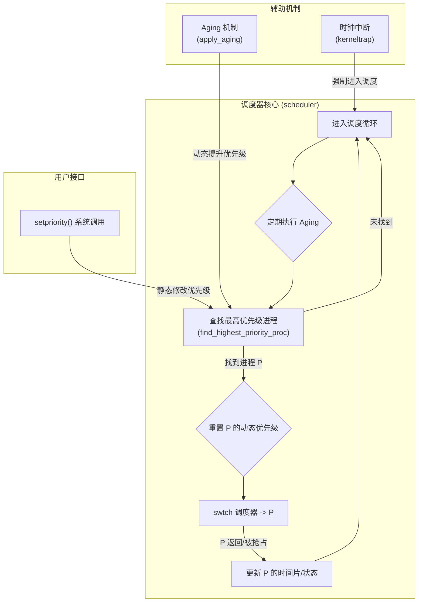

---

# 扩展实验：优先级调度系统

**姓名**：李璋平
**学号**：2023302051087
**日期**：2025-12-16

## 一、实验概述

### 实验目标

本次实验是基于已有的进程管理和调度框架进行的扩展。核心目标是实现一个功能完善的**优先级调度系统**，以取代原有的简单调度策略。该系统需要解决简单优先级调度可能带来的“饥饿”问题，并提供更灵活的进程调度控制。具体任务包括：
1.  **优先级模型**: 在进程控制块（PCB）中增加优先级字段，并设计多级优先级模型。
2.  **优先级调度器**: 修改调度器核心逻辑，使其总是选择当前可运行的、优先级最高的进程来执行。
3.  **Aging机制**: 实现“老化”机制，动态提升长时间等待的低优先级进程的优先级，防止其饥饿。
4.  **抢占式调度**: 确保高优先级进程的创建或唤醒能够抢占当前正在运行的低优先级进程。
5.  **系统调用**: 提供 `setpriority` 和 `getpriority` 系统调用，允许用户程序查询和修改进程的优先级。

### 完成情况

- ✅ **PCB扩展**: 成功在 `struct proc` 中添加了 `priority`, `base_priority`, `time_slice` 等与调度相关的字段。
- ✅ **优先级调度器**: 成功重构了 `scheduler` 函数，其核心 `find_highest_priority_proc` 能够正确地在多级优先级队列中选择进程，并在同级队列中执行轮转。
- ✅ **Aging机制**: 成功实现了 `apply_aging` 函数，能够在调度循环中定期调用，有效防止了低优先级进程的饥饿。
- ✅ **抢占机制**: 结合实验四的时钟中断，高优先级进程能够抢占低优先级进程的执行。
- ✅ **系统调用接口**: 成功实现了 `sys_setpriority` 和 `sys_getpriority`，并提供了用户态测试程序。
- ✅ **综合测试**: 编写了包括优先级抢占、Aging、同级轮转等多种场景的测试用例，并全部通过。

### 开发环境

- **操作系统**: Ubuntu 22.04.5 LTS
- **工具链 (GCC)**: riscv64-unknown-elf-gcc 12.2.0
- **模拟器 (QEMU)**: 8.2.0

---

## 二、技术设计

### 1. 系统架构与调度模型

新的调度系统在原有的 `scheduler -> swtch -> proc` 循环基础上，引入了更复杂的决策逻辑。



**调度模型**:
-   **多级反馈队列 的简化实现**:
    -   系统定义了多个离散的优先级（`PRIORITY_HIGH` 到 `PRIORITY_IDLE`）。
    -   调度器**总是**选择当前存在的、优先级最高的队列中的 `RUNNABLE` 进程。
    -   在同一个优先级的队列内部，采用**轮转** 策略来保证公平性。
-   **抢占式**:
    -   **时钟抢占**: 时钟中断会强制当前运行的进程返回调度器，让调度器有机会重新评估并选择优先级最高的进程。
    -   **优先级抢占**: 当一个高优先级进程从 `SLEEPING` 状态被唤醒变为 `RUNNABLE` 时，如果当前运行的是一个低优先级进程，在下一次时钟中断时，调度器将立即切换到这个高优先级进程。
-   **动态优先级调整 (Aging)**:
    -   为了防止高优先级任务持续运行导致低优先级任务“饥饿”，系统会定期检查所有 `RUNNABLE` 进程的等待时间。
    -   如果一个低优先级进程的等待时间超过了某个阈值 (`AGING_THRESHOLD`)，它的**当前优先级**就会被临时提升一级。
    -   一旦这个进程获得运行机会，它的优先级会被**重置**回其**基础优先级 (`base_priority`)**。

### 2. 关键数据结构：扩展的 PCB

为了支持优先级调度，`struct proc` 进行了如下扩展：

```c
// proch.h
struct proc {
  // ... 原有字段 ...

  // 优先级调度相关字段
  int priority;           // 进程的当前动态优先级 (可能被 Aging 提升)
  int base_priority;      // 基础优先级 (由 setpriority 设置，不会因aging改变)
  uint64_t time_slice;    // 时间片大小 (可根据优先级设置)
  
  // 用于 Aging 和性能统计的字段
  uint64_t cpu_time;      // 已使用的CPU时间
  uint64_t last_run;      // 上次被调度运行的时间点
  uint64_t wait_start;    // 开始等待的时间点 (变为 RUNNABLE 的时间)
  uint64_t total_wait;    // 累计等待时间
};
```
-   **`priority` vs `base_priority`**: 分离当前优先级和基础优先级是实现 Aging 机制的关键。`base_priority` 是进程的“固有”优先级，而 `priority` 是可能被动态调整的“临时”优先级。

---

## 三、实现细节与关键代码

### 1. 关键函数：`proc.c/scheduler()` - 优先级调度器

调度器的核心循环被重构，以集成优先级查找和 Aging 机制。

```c
// proc.c
void scheduler(void) {
    struct proc *p;
    struct cpu *c = mycpu();
    static uint64_t aging_counter = 0;

    for (;;) {
        intr_on();
        acquire(&ptable_lock);

        // 1. 定期执行 Aging 机制
        aging_counter++;
        if (aging_counter % AGING_INTERVAL == 0) {
            apply_aging();
        }

        // 2. 查找最高优先级的可运行进程
        p = find_highest_priority_proc();

        if (p != 0) {
            // 找到了一个进程
            p->state = RUNNING;
            c->proc = p;

            // 3. 当进程开始运行时，重置其被 Aging 提升的优先级
            reset_priority_to_base(p);

            // 4. 切换上下文
            swtch(&c->context, &p->context);
            
            c->proc = 0;
        }
        release(&ptable_lock);
    }
}
```
**实现要点**:
-   `scheduler` 的主逻辑现在是“Aging -> 查找 -> 运行”，确保了在每次调度决策前，都会考虑更新进程的动态优先级。

### 2. 关键函数：`proc.c/find_highest_priority_proc()` - 查找最佳进程

这个函数是优先级调度策略的核心实现。

```c
// proc.c
struct proc* find_highest_priority_proc(void) {
    int highest_priority = MAX_PRIORITY + 1;
    struct proc *candidates[NPROC];
    int candidate_count = 0;
    static struct proc *last_scheduled = 0; // 用于同级轮转

    // 第一轮：找到当前存在的最高优先级
    for (struct proc *p = procs; p < &procs[NPROC]; p++) {
        if (p->state == RUNNABLE && p->priority < highest_priority) {
            highest_priority = p->priority;
        }
    }

    if (highest_priority > MAX_PRIORITY) return 0; // 没有可运行的进程

    // 第二轮：收集所有同等最高优先级的候选进程
    for (struct proc *p = procs; p < &procs[NPROC]; p++) {
        if (p->state == RUNNABLE && p->priority == highest_priority) {
            candidates[candidate_count++] = p;
        }
    }

    // 第三轮：在同级候选者中进行 Round-Robin
    if (candidate_count == 1) return candidates[0];
    
    if (last_scheduled) {
        for (int i = 0; i < candidate_count; i++) {
            if (candidates[i] == last_scheduled) {
                // 返回上一个调度进程的下一个
                return candidates[(i + 1) % candidate_count];
            }
        }
    }
    
    // 如果没有历史记录，或历史记录无效，则返回第一个
    return candidates[0];
}
```
**实现要点**:
-   **多遍扫描**: 通过两遍扫描，清晰地分离了“确定最高优先级”和“在同级中选择”这两个步骤。
-   **同级公平性**: 通过记录 `last_scheduled` 进程，实现了在多个具有相同最高优先级的进程之间的轮转调度，保证了同级进程的公平性。

### 3. 关键函数：`proc.c/apply_aging()` - 防止饥饿

这是防止低优先级进程被饿死的关键机制。

```c
// proc.c
void apply_aging(void) {
    uint64_t current_time = get_time();

    for (struct proc *p = procs; p < &procs[NPROC]; p++) {
        // 只对正在等待的、且不是最高优先级的进程进行老化
        if (p->state == RUNNABLE && p->priority > PRIORITY_HIGH) {
            uint64_t wait_time = current_time - p->wait_start;

            // 如果等待时间超过阈值，提升一级优先级
            if (wait_time > AGING_THRESHOLD) {
                p->priority--;
                p->wait_start = current_time; // 重置等待计时
                printf("Aging: boosted process %d priority to %d\n", p->pid, p->priority);
            }
        }
    }
}
```
**实现要点**:
-   **基于等待时间**: 老化机制的核心是监控进程处于 `RUNNABLE` 状态的持续时间。
-   **动态提升**: 它只修改 `priority`（当前优先级），而不触动 `base_priority`。一旦进程被调度，`scheduler` 会调用 `reset_priority_to_base()` 将其优先级恢复，这确保了 Aging 只是一个临时的“帮助”，不会永久改变进程的设定。


### **4.关键代码：时间管理与动态优先级**

为了实现 Aging 等动态调度策略，内核必须能够获取时间并追踪进程的等待与运行状态。以下是 `proc.c` 中实现这些功能的关键函数。

#### **`get_time()` - 获取时间戳**

这是所有时间相关计算的基础。它通过读取 RISC-V CPU 内置的 `cycle` 计数器来获取一个高精度的、单调递增的时间戳。

```c
// proc.c

// 获取当前时间（从硬件 cycle 计数器读取）
uint64_t get_time(void) {
    uint64_t cycles;
    // 使用内联汇编读取 CSR 'cycle'
    asm volatile("csrr %0, cycle" : "=r"(cycles));
    return cycles;
}
```
**实现要点**:
-   **硬件依赖**: 这个函数直接与硬件交互，`csrr` 是一条特权指令，用于读取 `cycle` 寄存器。
-   **高精度**: `cycle` 寄存器记录了自CPU上电以来的时钟周期数

#### **`update_wait_time()` - 更新进程等待状态**
此函数在每次调度循环开始时被调用，用于更新所有进程的等待计时器。
```c
// proc.c

void update_wait_time(struct proc *p) {
    uint64_t current_time = get_time();

    if (p->state == RUNNABLE && p->wait_start == 0) {
        // 进程刚刚变为 RUNNABLE，记录等待开始的时间点
        p->wait_start = current_time;
    } else if (p->state == RUNNING) {
        // 进程正在运行
        if (p->wait_start > 0) {
            // 进程之前在等待，现在被调度了，计算并累加等待时间
            p->total_wait += current_time - p->wait_start;
            // 重置等待开始时间，表示它不再等待
            p->wait_start = 0;
        }
    }
}
```
**实现要点**:
-   **状态驱动**: 函数的行为完全取决于进程的当前状态 (`state`) 和 `wait_start` 字段。
-   **时间戳逻辑**: 通过记录进程进入 `RUNNABLE` 状态的时间戳 `wait_start`，并在其变为 `RUNNING` 时计算差值，精确地追踪了进程的等待时间，这是 Aging 机制的数据基础。

#### **`update_time_slice()` - 更新进程运行状态**

当一个进程的时间片用完或主动放弃CPU后，此函数被调用以更新其运行统计信息，并可能根据其行为调整优先级。

```c
// proc.c

void update_time_slice(struct proc *p) {
    // 增加进程的总 CPU 使用时间计数
    p->cpu_time++;
    // 更新进程的最后运行时间
    p->last_run = get_time();

    // 简单的动态优先级调整：惩罚 CPU 密集型进程
    // 如果一个进程连续运行了很长时间，就降低其优先级
    if (p->cpu_time > 500 && p->priority < MAX_PRIORITY) {
        p->priority++;  // 降低优先级 (数值越大，优先级越低)
        printf("Process %d priority downgraded to %d due to high CPU usage\n", p->pid, p->priority);
    }
}
```
**实现要点**:
-   **动态调整**: 这部分代码实现了一个简单的**动态优先级调整**策略。它通过追踪 `cpu_time` 来识别 CPU 密集型任务，并逐步降低它们的优先级，从而为 I/O 密集型或交互式任务提供更好的响应性。
-   **反馈机制**: 这是“多级**反馈**队列”中“反馈”一词的体现。调度器根据进程过去的行为（`cpu_time`）来预测其未来的行为，并相应地调整其调度策略。

### 5. 关键代码：`syscall.c/sys_setpriority()` - 系统调用接口

这个系统调用为用户空间提供了控制进程调度的能力。

```c
// syscall.c
uint64_t sys_setpriority(void) {
    // 从 trapframe 中获取参数
    int pid = myproc()->trapframe->a0;
    int priority = myproc()->trapframe->a1;

    if (priority < PRIORITY_HIGH || priority > PRIORITY_IDLE) {
        return -1; // 无效优先级
    }

    acquire(&ptable_lock);
    for (struct proc *p = procs; p < &procs[NPROC]; p++) {
        if (p->pid == pid) {
            set_priority(p, priority); // 调用内核函数设置优先级
            release(&ptable_lock);
            return 0; // 成功
        }
    }
    release(&ptable_lock);
    return -1; // 进程不存在
}

// 在 proc.c 中
void set_priority(struct proc *p, int priority) {
    p->priority = priority;
    p->base_priority = priority; // 同时设置基础和当前优先级

    // (可选) 根据优先级调整时间片
    // ...
}
```
**实现要点**:
-   **用户/内核边界**: `sys_setpriority` 是用户态请求和内核调度策略之间的桥梁。它负责从用户提供的参数（寄存器）中解析出意图，并调用相应的内核内部函数 `set_priority` 来执行。
-   **基础优先级**: 用户通过此系统调用设置的是进程的 `base_priority`，这是进程的“基准”优先级，Aging 机制不会修改它。


### **6.关键代码：用户态接口 - `user/shell.c/nice` 命令**

为了让用户能够与我们新实现的优先级调度系统交互，我们在用户态的 `shell` 程序中增加了一个 `nice` 命令。这个命令作为一个用户接口，负责解析用户输入，并通过 `setpriority` 和 `getpriority` 系统调用与内核通信。

```c
// shell.c

// Nice命令的实现函数
void cmd_nice(char *args) {
    // 目标：解析 "nice <pid> <priority>" 格式的命令
    int pid = 0;
    int priority = 0;

    // 1. 简单的参数合法性检查与帮助信息
    if (args == 0 || args[0] == '\0') {
        printf("Usage: nice <pid> <priority>\n");
        printf("Priority: 0=HIGH, 1=NORMAL, 2=LOW, 3=IDLE\n");
        return;
    }

    // 2. 手动解析字符串参数
    //    这是一个简化的atoi实现，用于从参数字符串中提取数字
    char *p = args;
    while (*p == ' ') p++; // 跳过前导空格
    while (*p >= '0' && *p <= '9') {
        pid = pid * 10 + (*p - '0');
        p++;
    }
    while (*p == ' ') p++;
    while (*p >= '0' && *p <= '9') {
        priority = priority * 10 + (*p - '0');
        p++;
    }

    // 3. 验证解析后的参数
    if (pid == 0 || priority < 0 || priority > 3) {
        printf("Invalid PID or priority value.\n");
        return;
    }

    printf("Setting PID %d priority to %d...\n", pid, priority);

    // 4. 调用 setpriority 系统调用
    int result = setpriority(pid, priority);

    // 5. 处理系统调用返回值并验证
    if (result == 0) {
        // 调用成功，再通过 getpriority 系统调用来验证
        int current_priority = getpriority(pid);
        printf("Success! PID %d priority is now %d\n", pid, current_priority);
    } else {
        printf("Failed to change priority (process may not exist)\n");
    }
}

// 在 shell 主循环中添加对 nice 命令的调用
int main(void) {
    // ...
    while (1) {
        // ... (读取和解析命令) ...
        
        if (strcmp(command, "nice") == 0) {
            cmd_nice(args); // 调用 nice 命令处理函数
        } 
        // ... (处理其他命令) ...
    }
    // ...
}
```
**实现要点**:
-   **用户态视角**: `cmd_nice` 函数完全在用户空间运行。它不知道内核如何实现优先级，只知道可以通过 `setpriority` 和 `getpriority` 这两个“黑盒”接口来与之交互。
-   **参数解析**: 由于用户态没有 `atoi` 等标准库函数，代码中实现了一个简易的、手动的字符串到整数的转换逻辑。
-   **系统调用封装**: `setpriority(pid, priority)` 和 `getpriority(pid)` 并非直接的函数调用，而是定义在 `user.h` 中、通过 `usys.S` 实现的系统调用存根。它们负责将参数放入寄存器并执行 `ecall` 指令，从而触发内核服务。`cmd_nice` 完美地展示了用户程序如何使用这些封装好的接口。